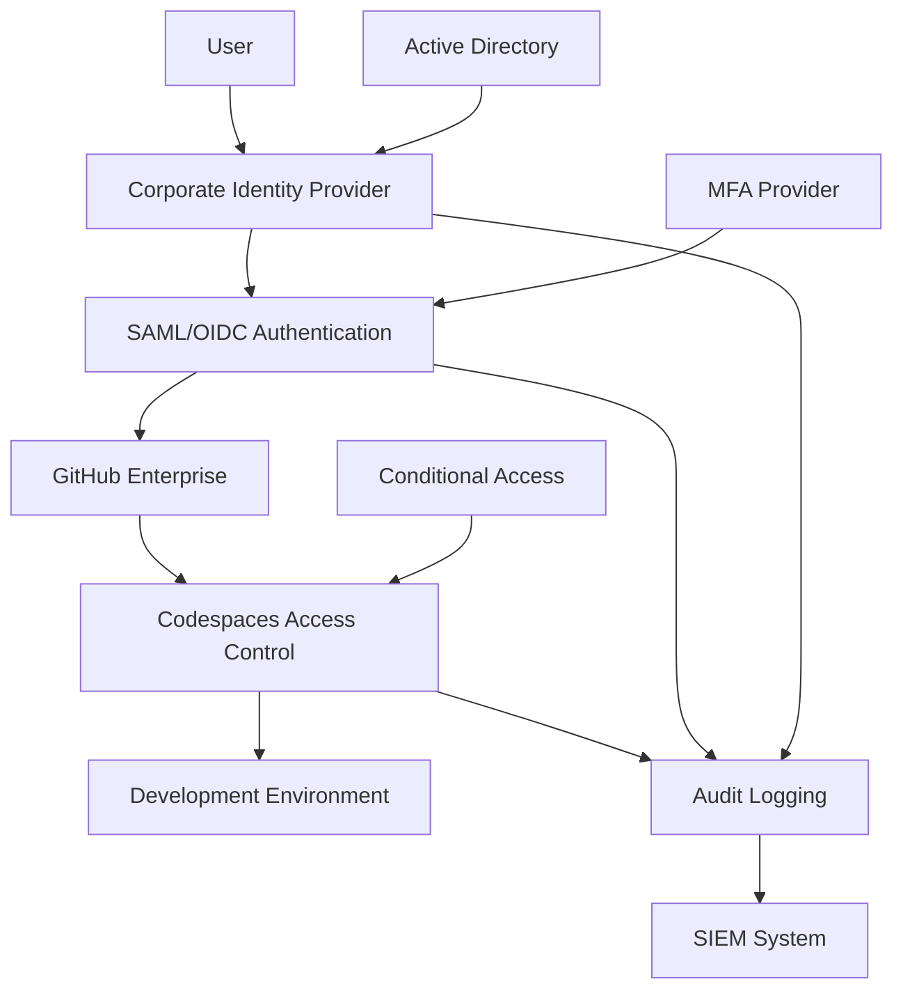

# SSO Integration for BFSI Codespaces

## Overview

This document outlines Single Sign-On (SSO) integration strategies for GitHub Codespaces in Indian Financial Institutions, ensuring secure authentication, compliance with regulatory requirements, and seamless user experience while maintaining strict access controls.

## 🔐 Authentication Architecture

### SSO Integration Components



### Supported Identity Providers

```yaml
identity_providers:
  azure_active_directory:
    type: "Primary IDP"
    protocol: "SAML 2.0 / OpenID Connect"
    mfa_support: true
    conditional_access: true
    compliance_features:
      - "Risk-based authentication"
      - "Device compliance verification"
      - "Location-based access controls"
      - "Session management"
    
    configuration:
      tenant_id: "${AZURE_TENANT_ID}"
      client_id: "${AZURE_CLIENT_ID}"
      client_secret: "${AZURE_CLIENT_SECRET}"
      redirect_uri: "https://github.com/orgs/${ORG}/saml/consume"
      issuer: "https://sts.windows.net/${AZURE_TENANT_ID}/"
      sso_url: "https://login.microsoftonline.com/${AZURE_TENANT_ID}/saml2"
  
  okta:
    type: "Secondary IDP"
    protocol: "SAML 2.0"
    mfa_support: true
    conditional_access: true
    compliance_features:
      - "Adaptive MFA"
      - "Device trust verification"
      - "Network zone restrictions"
      - "Session policies"
    
    configuration:
      okta_domain: "${OKTA_DOMAIN}"
      app_id: "${OKTA_APP_ID}"
      issuer: "http://www.okta.com/${OKTA_ISSUER_ID}"
      sso_url: "https://${OKTA_DOMAIN}/app/${OKTA_APP_ID}/sso/saml"
      metadata_url: "https://${OKTA_DOMAIN}/app/${OKTA_APP_ID}/sso/saml/metadata"
  
  ping_identity:
    type: "Enterprise IDP"
    protocol: "SAML 2.0 / OAuth 2.0"
    mfa_support: true
    conditional_access: true
    compliance_features:
      - "Risk intelligence"
      - "Fraud detection"
      - "Device fingerprinting"
      - "Behavioral analytics"
```

## 🏛️ BFSI Compliance Requirements

### Regulatory Framework Alignment

```yaml
compliance_requirements:
  rbi_it_framework:
    authentication_controls:
      - "Multi-factor authentication mandatory"
      - "Strong password policies"
      - "Session timeout controls"
      - "Account lockout mechanisms"
      - "Privileged access management"
    
    audit_requirements:
      - "Authentication event logging"
      - "Failed login attempt tracking"
      - "Session management auditing"
      - "Privilege escalation monitoring"
      - "7-year log retention"
    
    data_protection:
      - "Credential encryption in transit"
      - "Secure credential storage"
      - "Data residency compliance"
      - "Cross-border data transfer controls"
  
  sebi_it_governance:
    access_controls:
      - "Role-based access control"
      - "Segregation of duties"
      - "Regular access reviews"
      - "Automated provisioning/deprovisioning"
      - "Emergency access procedures"
    
    governance_controls:
      - "Identity governance workflows"
      - "Access certification processes"
      - "Compliance reporting"
      - "Risk assessment integration"
  
  irdai_cybersecurity:
    security_controls:
      - "Cybersecurity framework alignment"
      - "Incident response integration"
      - "Threat intelligence feeds"
      - "Security monitoring"
      - "Vulnerability management"
    
    data_localization:
      - "Identity data within India"
      - "Authentication logs in Indian data centers"
      - "Backup and DR in India"
      - "Vendor data handling compliance"
```

### Authentication Policy Configuration

```yaml
authentication_policies:
  password_policy:
    minimum_length: 14
    complexity_requirements:
      - "At least one uppercase letter"
      - "At least one lowercase letter"
      - "At least one number"
      - "At least one special character"
      - "No common dictionary words"
      - "No personal information"
    
    password_history: 24
    max_age_days: 90
    min_age_days: 1
    lockout_threshold: 5
    lockout_duration_minutes: 30
    reset_frequency_limit: 3  # per day
  
  mfa_policy:
    required_for_all_users: true
    acceptable_methods:
      - "Microsoft Authenticator (preferred)"
      - "Hardware security keys (FIDO2)"
      - "SMS (backup only)"
      - "Voice call (backup only)"
    
    backup_codes:
      enabled: true
      quantity: 10
      single_use: true
      expiry_days: 30
    
    session_requirements:
      mfa_frequency: "per_session"
      high_risk_re_auth: "immediate"
      step_up_authentication: "enabled"
  
  session_management:
    max_session_duration: 480  # 8 hours
    idle_timeout_minutes: 30
    concurrent_sessions_limit: 3
    session_fixation_protection: true
    secure_cookie_attributes: true
    
    high_privilege_sessions:
      max_duration: 120  # 2 hours
      idle_timeout: 15   # minutes
      re_authentication_required: true
```

## 🔧 Implementation Configuration

### Azure Active Directory Integration

```yaml
azure_ad_configuration:
  tenant_configuration:
    tenant_id: "${AZURE_TENANT_ID}"
    domain_name: "bfsi-org.onmicrosoft.com"
    primary_domain: "bfsi-org.com"
    
  enterprise_application:
    name: "GitHub Enterprise SSO"
    app_id: "${GITHUB_ENTERPRISE_APP_ID}"
    object_id: "${GITHUB_ENTERPRISE_OBJECT_ID}"
    
    saml_configuration:
      identifier: "https://github.com/orgs/${GITHUB_ORG}"
      reply_url: "https://github.com/orgs/${GITHUB_ORG}/saml/consume"
      sign_on_url: "https://github.com/orgs/${GITHUB_ORG}/sso"
      logout_url: "https://github.com/logout"
      
      signing_certificate:
        type: "X.509"
        algorithm: "SHA-256"
        key_size: 2048
        validity_years: 3
      
      claims_mapping:
        name_id: "user.userprincipalname"
        given_name: "user.givenname"
        surname: "user.surname"
        email: "user.mail"
        department: "user.department"
        employee_id: "user.employeeid"
        role: "user.assignedroles"
  
  conditional_access_policies:
    require_mfa:
      name: "GitHub Codespaces - Require MFA"
      state: "enabled"
      conditions:
        applications: ["GitHub Enterprise SSO"]
        users: "all_users"
        locations: "any"
      controls:
        grant_controls: ["mfa"]
        session_controls: ["sign_in_frequency"]
    
    device_compliance:
      name: "GitHub Codespaces - Device Compliance"
      state: "enabled"
      conditions:
        applications: ["GitHub Enterprise SSO"]
        users: "all_users"
        device_platforms: ["windows", "macOS", "linux"]
      controls:
        grant_controls: ["compliant_device", "domain_joined_device"]
    
    location_based:
      name: "GitHub Codespaces - Location Restrictions"
      state: "enabled"
      conditions:
        applications: ["GitHub Enterprise SSO"]
        users: "all_users"
        locations: 
          include: ["india_offices", "approved_remote_locations"]
          exclude: ["high_risk_countries"]
      controls:
        grant_controls: ["block"]  # for excluded locations
```

### GitHub Enterprise SSO Configuration

```yaml
github_sso_configuration:
  organization_settings:
    sso_enabled: true
    sso_required: true
    enforce_sso_policy: true
    
    identity_provider:
      type: "SAML"
      metadata_url: "https://login.microsoftonline.com/${AZURE_TENANT_ID}/federationmetadata/2007-06/federationmetadata.xml"
      issuer: "https://sts.windows.net/${AZURE_TENANT_ID}/"
      sso_url: "https://login.microsoftonline.com/${AZURE_TENANT_ID}/saml2"
      certificate: "${SAML_SIGNING_CERTIFICATE}"
  
  attribute_mapping:
    username: "http://schemas.xmlsoap.org/ws/2005/05/identity/claims/name"
    email: "http://schemas.xmlsoap.org/ws/2005/05/identity/claims/emailaddress"
    name: "http://schemas.xmlsoap.org/ws/2005/05/identity/claims/givenname"
    surname: "http://schemas.xmlsoap.org/ws/2005/05/identity/claims/surname"
    department: "http://schemas.bfsi.com/department"
    employee_id: "http://schemas.bfsi.com/employeeid"
    role: "http://schemas.bfsi.com/role"
  
  access_controls:
    team_membership_sync: true
    role_based_access: true
    automatic_provisioning: true
    deprovisioning_policy: "immediate"
    
    team_mapping:
      developers:
        claim_value: "Developer"
        github_team: "developers"
        repositories: ["development-repos"]
        permissions: ["read", "write"]
      
      senior_developers:
        claim_value: "Senior Developer"
        github_team: "senior-developers"
        repositories: ["all-repos"]
        permissions: ["read", "write", "admin"]
      
      security_team:
        claim_value: "Security Engineer"
        github_team: "security-team"
        repositories: ["security-repos", "all-repos"]
        permissions: ["read", "write", "admin", "security"]
```

## 🔐 Multi-Factor Authentication

### MFA Implementation Strategy

```yaml
mfa_implementation:
  primary_methods:
    microsoft_authenticator:
      type: "TOTP"
      backup_method: true
      push_notifications: true
      number_matching: true
      geolocation_verification: true
      
    hardware_security_keys:
      type: "FIDO2/WebAuthn"
      manufacturers: ["YubiKey", "SoloKeys", "Google Titan"]
      attestation_required: true
      resident_keys: true
      user_verification: "required"
  
  backup_methods:
    sms_verification:
      enabled: true
      rate_limiting: "3_per_hour"
      country_restrictions: ["India only"]
      carrier_verification: true
      
    voice_call:
      enabled: true
      rate_limiting: "2_per_hour"
      country_restrictions: ["India only"]
      caller_id_verification: true
  
  emergency_access:
    backup_codes:
      quantity: 10
      single_use: true
      expiry_days: 90
      secure_delivery: "encrypted_email"
      
    admin_override:
      approval_required: "two_admins"
      time_limited: "24_hours"
      audit_trail: "comprehensive"
      justification_required: true
```

### Adaptive Authentication

```yaml
adaptive_authentication:
  risk_assessment_factors:
    user_behavior:
      - "Login time patterns"
      - "Device fingerprinting"
      - "Location consistency"
      - "Application usage patterns"
      - "Network characteristics"
    
    contextual_factors:
      - "IP address reputation"
      - "Geolocation analysis"
      - "Device compliance status"
      - "Network security posture"
      - "Time-based access patterns"
    
    threat_intelligence:
      - "Known malicious IPs"
      - "Compromised credentials database"
      - "Attack pattern recognition"
      - "Behavioral anomalies"
      - "Industry threat feeds"
  
  risk_responses:
    low_risk:
      authentication: "standard"
      session_duration: "8_hours"
      monitoring_level: "normal"
      
    medium_risk:
      authentication: "step_up_mfa"
      session_duration: "4_hours"
      monitoring_level: "enhanced"
      additional_controls: ["device_verification"]
      
    high_risk:
      authentication: "strong_mfa_required"
      session_duration: "1_hour"
      monitoring_level: "intensive"
      additional_controls: ["admin_approval", "additional_verification"]
      
    critical_risk:
      authentication: "blocked"
      session_duration: "none"
      monitoring_level: "maximum"
      response: ["immediate_alert", "security_team_notification"]
```

## 📊 Monitoring and Compliance

### Authentication Monitoring

```python
#!/usr/bin/env python3
"""
BFSI SSO Monitoring and Compliance System
Real-time authentication monitoring for financial institutions
"""

import json
import logging
import datetime
import requests
from typing import Dict, List, Optional
from dataclasses import dataclass, asdict
import pandas as pd

@dataclass
class AuthenticationEvent:
    timestamp: str
    user_id: str
    username: str
    event_type: str
    source_ip: str
    user_agent: str
    location: Dict[str, str]
    mfa_method: Optional[str]
    risk_score: float
    compliance_flags: List[str]
    session_id: str
    device_id: str

class BFSISSOMonitor:
    """SSO monitoring system for BFSI compliance."""
    
    def __init__(self, config_file: str):
        with open(config_file, 'r') as f:
            self.config = json.load(f)
        
        logging.basicConfig(
            level=logging.INFO,
            format='%(asctime)s - %(levelname)s - %(message)s',
            handlers=[
                logging.FileHandler('/workspace/logs/audit/sso-monitoring.log'),
                logging.StreamHandler()
            ]
        )
        self.logger = logging.getLogger(__name__)
    
    def monitor_authentication_events(self):
        """Monitor and analyze authentication events."""
        try:
            # Fetch authentication events from Azure AD
            azure_events = self._fetch_azure_ad_events()
            
            # Fetch GitHub authentication events
            github_events = self._fetch_github_events()
            
            # Combine and analyze events
            all_events = azure_events + github_events
            
            for event in all_events:
                auth_event = self._parse_authentication_event(event)
                
                # Perform compliance checks
                compliance_result = self._check_compliance(auth_event)
                
                # Risk assessment
                risk_assessment = self._assess_risk(auth_event)
                
                # Generate alerts if needed
                if risk_assessment['risk_level'] == 'high':
                    self._generate_security_alert(auth_event, risk_assessment)
                
                # Log for audit compliance
                self._log_authentication_event(auth_event, compliance_result)
                
        except Exception as e:
            self.logger.error(f"Authentication monitoring failed: {e}")
    
    def _check_compliance(self, event: AuthenticationEvent) -> Dict:
        """Check authentication event against BFSI compliance requirements."""
        compliance_checks = {
            'rbi_compliance': {
                'mfa_required': event.mfa_method is not None,
                'location_verified': self._verify_location(event.location),
                'session_timeout': self._check_session_timeout(event),
                'audit_logged': True  # Always true since we're logging
            },
            
            'sebi_compliance': {
                'role_based_access': self._verify_role_access(event),
                'segregation_of_duties': self._check_segregation(event),
                'access_review_current': self._check_access_review(event.user_id)
            },
            
            'irdai_compliance': {
                'cybersecurity_framework': self._check_cyber_framework(event),
                'data_localization': self._verify_data_residency(event),
                'incident_response': self._check_incident_response(event)
            }
        }
        
        # Calculate overall compliance score
        compliance_score = self._calculate_compliance_score(compliance_checks)
        
        return {
            'compliance_checks': compliance_checks,
            'compliance_score': compliance_score,
            'compliance_status': 'COMPLIANT' if compliance_score >= 0.8 else 'NON_COMPLIANT'
        }
    
    def generate_compliance_report(self, start_date: str, end_date: str) -> str:
        """Generate SSO compliance report for regulatory requirements."""
        
        # Fetch authentication data for the period
        auth_data = self._fetch_authentication_data(start_date, end_date)
        
        # Analyze compliance metrics
        compliance_metrics = self._analyze_compliance_metrics(auth_data)
        
        report = {
            'report_metadata': {
                'generated_at': datetime.datetime.utcnow().isoformat(),
                'report_period': {'start': start_date, 'end': end_date},
                'report_type': 'BFSI_SSO_Compliance',
                'compliance_frameworks': ['RBI-IT-Framework-2021', 'SEBI-IT-Governance-2023', 'IRDAI-Cybersecurity-2020']
            },
            
            'executive_summary': {
                'total_authentication_events': len(auth_data),
                'successful_authentications': compliance_metrics['successful_count'],
                'failed_authentications': compliance_metrics['failed_count'],
                'mfa_adoption_rate': compliance_metrics['mfa_rate'],
                'compliance_score': compliance_metrics['overall_compliance_score'],
                'security_incidents': compliance_metrics['security_incident_count']
            },
            
            'detailed_analysis': {
                'authentication_patterns': compliance_metrics['patterns'],
                'risk_analysis': compliance_metrics['risk_analysis'],
                'compliance_violations': compliance_metrics['violations'],
                'improvement_recommendations': compliance_metrics['recommendations']
            },
            
            'regulatory_compliance': {
                'rbi_it_framework': {
                    'authentication_controls_score': compliance_metrics['rbi_auth_score'],
                    'audit_requirements_score': compliance_metrics['rbi_audit_score'],
                    'data_protection_score': compliance_metrics['rbi_data_score']
                },
                'sebi_it_governance': {
                    'access_controls_score': compliance_metrics['sebi_access_score'],
                    'governance_controls_score': compliance_metrics['sebi_governance_score']
                },
                'irdai_cybersecurity': {
                    'security_controls_score': compliance_metrics['irdai_security_score'],
                    'data_localization_score': compliance_metrics['irdai_localization_score']
                }
            },
            
            'audit_trail': {
                'data_sources': ['Azure AD Logs', 'GitHub Audit Logs', 'Security Event Logs'],
                'data_integrity': 'Verified with digital signatures',
                'retention_compliance': '7 years as per RBI requirements',
                'access_controls': 'Role-based access to audit data'
            }
        }
        
        # Save report for regulatory compliance
        report_file = f"/workspace/logs/audit/sso-compliance-report-{datetime.date.today()}.json"
        with open(report_file, 'w') as f:
            json.dump(report, f, indent=2)
        
        self.logger.info(f"SSO compliance report generated: {report_file}")
        return json.dumps(report, indent=2)

# SSO Configuration Script
def configure_sso_integration():
    """Configure SSO integration for BFSI environment."""
    
    sso_config = {
        "azure_ad": {
            "tenant_id": "${AZURE_TENANT_ID}",
            "client_id": "${AZURE_CLIENT_ID}",
            "client_secret": "${AZURE_CLIENT_SECRET}",
            "authority": "https://login.microsoftonline.com/${AZURE_TENANT_ID}",
            "scopes": ["openid", "profile", "email", "offline_access"]
        },
        
        "github_enterprise": {
            "organization": "${GITHUB_ORG}",
            "saml_metadata_url": "https://login.microsoftonline.com/${AZURE_TENANT_ID}/federationmetadata/2007-06/federationmetadata.xml",
            "attribute_mapping": {
                "username": "http://schemas.xmlsoap.org/ws/2005/05/identity/claims/name",
                "email": "http://schemas.xmlsoap.org/ws/2005/05/identity/claims/emailaddress",
                "name": "http://schemas.xmlsoap.org/ws/2005/05/identity/claims/givenname"
            }
        },
        
        "compliance_settings": {
            "mfa_required": True,
            "session_timeout": 480,  # 8 hours
            "audit_logging": True,
            "data_residency": "India",
            "encryption_in_transit": True
        }
    }
    
    return sso_config

def main():
    """Main SSO monitoring function."""
    monitor = BFSISSOMonitor('/workspace/config/sso-monitoring-config.json')
    
    # Start continuous monitoring
    monitor.monitor_authentication_events()
    
    # Generate daily compliance report
    today = datetime.date.today()
    yesterday = today - datetime.timedelta(days=1)
    
    report = monitor.generate_compliance_report(
        yesterday.isoformat(),
        today.isoformat()
    )
    
    print("SSO Compliance Report Generated")
    print(f"Report saved to audit logs")

if __name__ == "__main__":
    main()
```

## 🚨 Security Incident Response

### SSO-Related Incident Types

```yaml
incident_types:
  authentication_failures:
    brute_force_attacks:
      threshold: "5 failed attempts in 5 minutes"
      response: "Account lockout, security team alert"
      escalation: "CISO notification after 10 accounts"
      
    credential_stuffing:
      indicators: "Multiple users, same IP, password spraying"
      response: "IP blocking, user notifications, forced password reset"
      escalation: "Immediate security team involvement"
    
    impossible_travel:
      detection: "Login from geographically impossible locations"
      response: "Session termination, account review"
      escalation: "Security investigation"
  
  authorization_violations:
    privilege_escalation:
      detection: "Unauthorized role changes or access attempts"
      response: "Immediate access revocation, incident investigation"
      escalation: "Security and compliance team notification"
      
    segregation_of_duties:
      detection: "User accessing conflicting roles or resources"
      response: "Access review, manager notification"
      escalation: "Compliance team review"
  
  session_anomalies:
    concurrent_sessions:
      threshold: "More than 3 concurrent sessions"
      response: "Additional authentication required"
      escalation: "Security review for repeated violations"
      
    session_hijacking:
      indicators: "Session token reuse, IP changes mid-session"
      response: "Immediate session termination, security investigation"
      escalation: "Critical incident response"
```

## 📞 Support and Escalation

### SSO Support Structure

```yaml
support_tiers:
  tier_1:
    scope: "Password resets, basic authentication issues"
    contact: "it-helpdesk@bfsi-org.com"
    sla: "2 hours response time"
    escalation_criteria: "MFA issues, access violations"
    
  tier_2:
    scope: "SSO configuration, attribute mapping, advanced troubleshooting"
    contact: "identity-team@bfsi-org.com"
    sla: "4 hours response time"
    escalation_criteria: "Security incidents, compliance violations"
    
  tier_3:
    scope: "Security incidents, compliance investigations, architecture changes"
    contact: "security-team@bfsi-org.com"
    sla: "1 hour response time"
    escalation_criteria: "Critical security events, regulatory violations"

emergency_contacts:
  security_incidents: "security-emergency@bfsi-org.com"
  compliance_violations: "compliance-emergency@bfsi-org.com"
  system_outages: "infrastructure-emergency@bfsi-org.com"
  escalation_hotline: "+91-XXXX-XXXXXX"
```

---

**Document Version**: 1.0.0  
**Identity Architect**: [Name]  
**Last Updated**: November 2024  
**Review Frequency**: Quarterly  
**Approval**: BFSI Security Committee