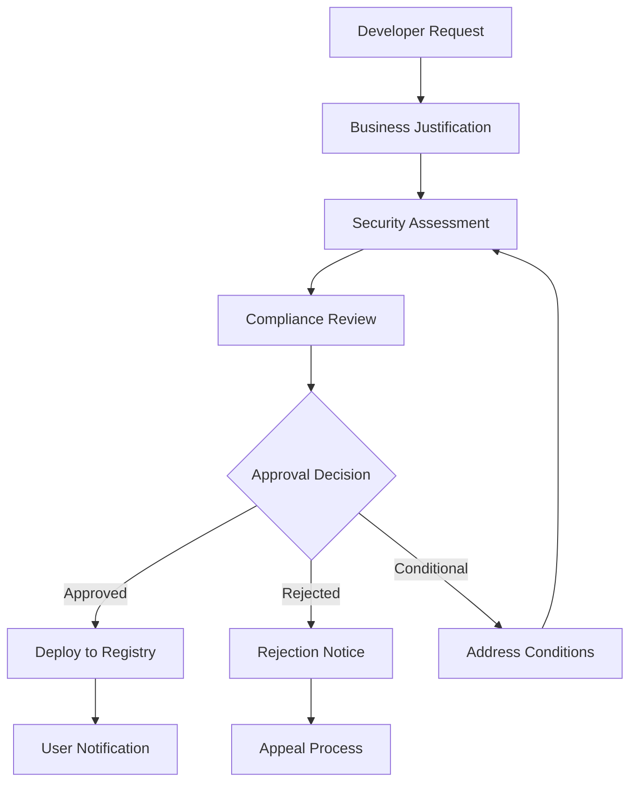

# Private Extension Marketplace for BFSI Codespaces

## Overview

This document outlines the setup and management of a private extension marketplace for GitHub Codespaces in Indian Financial Institutions, ensuring only enterprise-approved VS Code extensions are available to developers while maintaining security and compliance standards.

## 🏢 Enterprise Extension Strategy

### Extension Categories

```yaml
extension_categories:
  approved_extensions:
    security_tools:
      - "snyk-security.snyk-vulnerability-scanner"
      - "ms-vscode.vscode-github-copilot"
      - "github.vscode-github-actions"
      - "redhat.vscode-yaml"
      - "ms-vscode.vscode-json"
    
    development_tools:
      - "ms-python.python"
      - "ms-python.flake8"
      - "ms-python.black-formatter"
      - "ms-python.isort"
      - "ms-python.pylint"
      - "ms-python.mypy"
    
    database_tools:
      - "ms-mssql.mssql"
      - "humao.rest-client"
      - "mtxr.sqltools"
      - "rangav.vscode-thunder-client"
    
    productivity_tools:
      - "ms-vscode.test-adapter-converter"
      - "esbenp.prettier-vscode"
      - "bradlc.vscode-tailwindcss"
      - "ms-azuretools.vscode-docker"
  
  restricted_extensions:
    data_exporters:
      - "ms-vscode.vscode-json"  # Only specific versions
      - "mechatroner.rainbow-csv"  # Data export capabilities
    
    communication_tools:
      - "ms-vsliveshare.vsliveshare"  # Live sharing - security review required
      - "slack.slack-vscode"  # External communication
    
    ai_assistants:
      - "tabnine.tabnine-vscode"  # Code AI - requires approval
      - "visualstudioexptteam.vscodeintellicode"  # Microsoft IntelliCode
  
  blocked_extensions:
    security_risks:
      - "*code-runner*"  # Arbitrary code execution
      - "*remote-ssh*"   # Remote access capabilities
      - "*ftp-sync*"     # File transfer capabilities
      - "*sftp*"         # Secure file transfer
    
    data_leakage_risks:
      - "*gist*"         # Code sharing with external services
      - "*pastebin*"     # External paste services
      - "*hastebin*"     # External text sharing
      - "*snippet*"      # Code snippet sharing
    
    unapproved_ai:
      - "*openai*"       # Unauthorized AI services
      - "*chatgpt*"      # External AI assistants
      - "*anthropic*"    # External AI services
```

### Extension Security Assessment

```yaml
security_assessment_criteria:
  publisher_verification:
    trusted_publishers:
      - "Microsoft"
      - "Red Hat"
      - "GitHub"
      - "Snyk"
      - "HashiCorp"
    
    verification_process:
      - "Publisher identity verification"
      - "Extension source code review"
      - "Security vulnerability assessment"
      - "Data handling practices review"
      - "Compliance with enterprise policies"
  
  functionality_review:
    allowed_capabilities:
      - "Code editing and formatting"
      - "Syntax highlighting and language support"
      - "Debugging and testing tools"
      - "Version control integration"
      - "Security scanning and analysis"
    
    restricted_capabilities:
      - "Network access to external services"
      - "File system access outside workspace"
      - "System command execution"
      - "User credential handling"
      - "Data transmission to third parties"
    
    prohibited_capabilities:
      - "Arbitrary code execution"
      - "System configuration modification"
      - "Unauthorized network communications"
      - "Credential theft or phishing"
      - "Data exfiltration mechanisms"
```

## 🔧 Implementation Architecture

### Private Extension Registry

```yaml
registry_architecture:
  components:
    package_registry:
      type: "Azure DevOps Artifacts"
      location: "India South region"
      authentication: "Azure AD integration"
      encryption: "TLS 1.3 in transit, AES-256 at rest"
    
    extension_store:
      type: "Internal web portal"
      authentication: "SAML SSO"
      authorization: "Role-based access control"
      audit_logging: "All access and downloads logged"
    
    approval_workflow:
      type: "Microsoft Power Platform"
      approvers: ["Security Team", "Compliance Team", "Tech Leads"]
      sla: "5 business days for new extensions"
      emergency_process: "24-hour expedited review"
  
  integration_points:
    github_actions:
      purpose: "Automated extension validation"
      security_scanning: "SAST and dependency analysis"
      compliance_checks: "Policy compliance verification"
    
    active_directory:
      purpose: "User authentication and authorization"
      groups: ["Developers", "Senior Developers", "Security Team"]
      policies: "Extension access based on role"
    
    monitoring_tools:
      purpose: "Usage tracking and compliance monitoring"
      metrics: ["Extension usage", "Security events", "Policy violations"]
      alerting: "Real-time security and compliance alerts"
```

### Extension Deployment Pipeline

```yaml
deployment_pipeline:
  stages:
    submission:
      - "Extension request submitted via portal"
      - "Automatic security scan initiated"
      - "Business justification required"
      - "Risk assessment questionnaire"
    
    security_review:
      - "Static analysis of extension code"
      - "Dependency vulnerability scanning"
      - "Permission and capability analysis"
      - "Data flow and privacy assessment"
    
    compliance_review:
      - "RBI IT Framework compliance check"
      - "SEBI IT Governance requirements"
      - "IRDAI Cybersecurity guidelines"
      - "Internal policy alignment"
    
    approval:
      - "Security team approval required"
      - "Compliance team sign-off"
      - "Technical lead endorsement"
      - "Business stakeholder approval"
    
    deployment:
      - "Extension added to private registry"
      - "User access controls configured"
      - "Installation instructions provided"
      - "Monitoring and alerting enabled"
    
    monitoring:
      - "Usage metrics collection"
      - "Security event monitoring"
      - "Compliance adherence tracking"
      - "Performance impact assessment"
```

## 📋 Extension Approval Process

### Request Workflow



### Approval Criteria

```yaml
approval_criteria:
  mandatory_requirements:
    security:
      - "No high or critical security vulnerabilities"
      - "Trusted publisher with verified identity"
      - "Source code available for review"
      - "No unauthorized network communications"
      - "Minimal system permissions required"
    
    compliance:
      - "Compliant with data localization requirements"
      - "No conflict with regulatory frameworks"
      - "Audit trail for all activities"
      - "Privacy policy aligned with GDPR/Indian laws"
      - "Support for enterprise authentication"
    
    business:
      - "Clear business value proposition"
      - "Alternative solutions evaluated"
      - "Cost-benefit analysis completed"
      - "Training requirements assessed"
      - "Support and maintenance plan"
  
  evaluation_matrix:
    security_score:
      weight: 40
      factors: ["Vulnerability count", "Publisher trust", "Permission scope"]
    
    compliance_score:
      weight: 30
      factors: ["Regulatory alignment", "Data handling", "Audit capabilities"]
    
    business_score:
      weight: 20
      factors: ["Business value", "User adoption", "Alternative options"]
    
    technical_score:
      weight: 10
      factors: ["Performance impact", "Compatibility", "Maintenance overhead"]
  
  minimum_thresholds:
    overall_score: 75
    security_score: 80
    compliance_score: 85
    critical_vulnerabilities: 0
    high_vulnerabilities: 0
```

### Extension Validation Script

```python
#!/usr/bin/env python3
"""
BFSI Extension Validation System
Automated security and compliance validation for VS Code extensions
"""

import json
import logging
import requests
import subprocess
import yaml
from typing import Dict, List, Optional, Tuple
from dataclasses import dataclass
from pathlib import Path

@dataclass
class ExtensionMetadata:
    id: str
    name: str
    publisher: str
    version: str
    description: str
    repository: Optional[str]
    license: Optional[str]
    categories: List[str]
    permissions: List[str]

@dataclass
class SecurityAssessment:
    vulnerability_count: Dict[str, int]
    permission_score: int
    publisher_trust_score: int
    code_quality_score: int
    overall_security_score: int
    recommendations: List[str]

@dataclass
class ComplianceAssessment:
    rbi_compliance: bool
    sebi_compliance: bool
    irdai_compliance: bool
    data_localization: bool
    audit_capabilities: bool
    overall_compliance_score: int
    gaps: List[str]

class BFSIExtensionValidator:
    """Extension validation system for BFSI compliance."""
    
    def __init__(self, config_file: str):
        with open(config_file, 'r') as f:
            self.config = yaml.safe_load(f)
        
        logging.basicConfig(
            level=logging.INFO,
            format='%(asctime)s - %(levelname)s - %(message)s',
            handlers=[
                logging.FileHandler('/workspace/logs/audit/extension-validation.log'),
                logging.StreamHandler()
            ]
        )
        self.logger = logging.getLogger(__name__)
    
    def validate_extension(self, extension_id: str) -> Tuple[bool, Dict]:
        """Perform comprehensive validation of an extension."""
        try:
            self.logger.info(f"Starting validation for extension: {extension_id}")
            
            # Get extension metadata
            metadata = self._get_extension_metadata(extension_id)
            if not metadata:
                return False, {"error": "Failed to retrieve extension metadata"}
            
            # Perform security assessment
            security_assessment = self._perform_security_assessment(metadata)
            
            # Perform compliance assessment
            compliance_assessment = self._perform_compliance_assessment(metadata)
            
            # Calculate overall score
            overall_score = self._calculate_overall_score(security_assessment, compliance_assessment)
            
            # Generate recommendation
            recommendation = self._generate_recommendation(
                overall_score, security_assessment, compliance_assessment
            )
            
            validation_result = {
                "extension_id": extension_id,
                "metadata": metadata.__dict__,
                "security_assessment": security_assessment.__dict__,
                "compliance_assessment": compliance_assessment.__dict__,
                "overall_score": overall_score,
                "recommendation": recommendation,
                "timestamp": self._get_timestamp()
            }
            
            # Log validation result for audit
            self._log_validation_result(validation_result)
            
            return True, validation_result
            
        except Exception as e:
            self.logger.error(f"Extension validation failed: {e}")
            return False, {"error": str(e)}
    
    def _perform_security_assessment(self, metadata: ExtensionMetadata) -> SecurityAssessment:
        """Perform comprehensive security assessment."""
        
        # Check for vulnerabilities
        vulnerabilities = self._scan_for_vulnerabilities(metadata)
        
        # Assess permissions
        permission_score = self._assess_permissions(metadata.permissions)
        
        # Check publisher trust
        publisher_trust = self._assess_publisher_trust(metadata.publisher)
        
        # Analyze code quality
        code_quality = self._assess_code_quality(metadata)
        
        # Calculate overall security score
        overall_security = self._calculate_security_score(
            vulnerabilities, permission_score, publisher_trust, code_quality
        )
        
        # Generate security recommendations
        recommendations = self._generate_security_recommendations(
            vulnerabilities, permission_score, publisher_trust
        )
        
        return SecurityAssessment(
            vulnerability_count=vulnerabilities,
            permission_score=permission_score,
            publisher_trust_score=publisher_trust,
            code_quality_score=code_quality,
            overall_security_score=overall_security,
            recommendations=recommendations
        )
    
    def _perform_compliance_assessment(self, metadata: ExtensionMetadata) -> ComplianceAssessment:
        """Perform BFSI compliance assessment."""
        
        # RBI IT Framework compliance
        rbi_compliant = self._check_rbi_compliance(metadata)
        
        # SEBI IT Governance compliance
        sebi_compliant = self._check_sebi_compliance(metadata)
        
        # IRDAI Cybersecurity compliance
        irdai_compliant = self._check_irdai_compliance(metadata)
        
        # Data localization requirements
        data_localization = self._check_data_localization(metadata)
        
        # Audit capabilities
        audit_capabilities = self._check_audit_capabilities(metadata)
        
        # Calculate overall compliance score
        overall_compliance = self._calculate_compliance_score(
            rbi_compliant, sebi_compliant, irdai_compliant, 
            data_localization, audit_capabilities
        )
        
        # Identify compliance gaps
        gaps = self._identify_compliance_gaps(
            rbi_compliant, sebi_compliant, irdai_compliant,
            data_localization, audit_capabilities
        )
        
        return ComplianceAssessment(
            rbi_compliance=rbi_compliant,
            sebi_compliance=sebi_compliant,
            irdai_compliance=irdai_compliant,
            data_localization=data_localization,
            audit_capabilities=audit_capabilities,
            overall_compliance_score=overall_compliance,
            gaps=gaps
        )
    
    def _check_rbi_compliance(self, metadata: ExtensionMetadata) -> bool:
        """Check RBI IT Framework compliance."""
        compliance_checks = {
            'information_security': self._check_information_security(metadata),
            'application_security': self._check_application_security(metadata),
            'data_security': self._check_data_security(metadata),
            'audit_monitoring': self._check_audit_monitoring(metadata)
        }
        
        # All checks must pass for RBI compliance
        return all(compliance_checks.values())
    
    def generate_approval_request(self, validation_result: Dict) -> str:
        """Generate approval request document."""
        
        request_document = {
            "request_metadata": {
                "submission_date": self._get_timestamp(),
                "requestor": "Developer Team",
                "business_unit": "BFSI Development",
                "urgency": "Normal"
            },
            
            "extension_details": {
                "id": validation_result["extension_id"],
                "name": validation_result["metadata"]["name"],
                "publisher": validation_result["metadata"]["publisher"],
                "version": validation_result["metadata"]["version"],
                "description": validation_result["metadata"]["description"],
                "business_justification": "Required for BFSI development activities"
            },
            
            "security_assessment": validation_result["security_assessment"],
            "compliance_assessment": validation_result["compliance_assessment"],
            "overall_score": validation_result["overall_score"],
            "recommendation": validation_result["recommendation"],
            
            "approval_workflow": {
                "security_team_approval": "Pending",
                "compliance_team_approval": "Pending", 
                "technical_lead_approval": "Pending",
                "estimated_approval_date": self._calculate_approval_date()
            },
            
            "implementation_plan": {
                "deployment_method": "Private registry",
                "user_groups": ["Developers", "Senior Developers"],
                "training_required": "Yes",
                "support_contact": "extension-support@bfsi-org.com"
            }
        }
        
        # Save approval request
        request_file = f"/workspace/logs/audit/extension-approval-{validation_result['extension_id']}.json"
        with open(request_file, 'w') as f:
            json.dump(request_document, f, indent=2)
        
        self.logger.info(f"Approval request generated: {request_file}")
        return json.dumps(request_document, indent=2)

# Example usage and configuration
def main():
    """Main extension validation workflow."""
    
    # Initialize validator
    validator = BFSIExtensionValidator('/workspace/config/extension-validation-config.yaml')
    
    # Example extension validation
    extension_id = "ms-python.python"
    
    success, result = validator.validate_extension(extension_id)
    
    if success:
        print(f"Validation completed for {extension_id}")
        print(f"Overall Score: {result['overall_score']}")
        print(f"Recommendation: {result['recommendation']}")
        
        # Generate approval request if needed
        if result['overall_score'] >= 75:
            approval_request = validator.generate_approval_request(result)
            print("Approval request generated")
        else:
            print("Extension does not meet minimum requirements")
    else:
        print(f"Validation failed: {result['error']}")

if __name__ == "__main__":
    main()
```

## 🔐 Access Control and Permissions

### Role-Based Extension Access

```yaml
extension_access_control:
  user_roles:
    junior_developer:
      allowed_categories: ["basic_development", "language_support"]
      max_extensions: 10
      approval_required: ["Security Team Lead"]
      
    developer:
      allowed_categories: ["development_tools", "testing_tools", "basic_security"]
      max_extensions: 20
      approval_required: ["Team Lead"]
      
    senior_developer:
      allowed_categories: ["all_development", "advanced_security", "database_tools"]
      max_extensions: 35
      approval_required: ["Tech Lead"]
      
    team_lead:
      allowed_categories: ["all_categories"]
      max_extensions: 50
      approval_required: ["Manager"]
      
    security_engineer:
      allowed_categories: ["all_security", "penetration_testing", "vulnerability_tools"]
      max_extensions: 40
      approval_required: ["CISO"]
      
    compliance_officer:
      allowed_categories: ["compliance_tools", "audit_tools", "reporting_tools"]
      max_extensions: 25
      approval_required: ["Chief Compliance Officer"]
  
  access_policies:
    installation_controls:
      - "User must be authenticated via SSO"
      - "Extension must be in approved list"
      - "User role must have permission for category"
      - "Installation logged for audit"
      - "Automatic updates controlled centrally"
    
    usage_monitoring:
      - "Extension usage tracked per user"
      - "Security events monitored in real-time"
      - "Compliance violations flagged immediately"
      - "Performance impact measured"
      - "License compliance verified"
```

## 📊 Extension Monitoring and Management

### Usage Analytics

```yaml
monitoring_framework:
  usage_metrics:
    installation_tracking:
      - "Extension installation requests"
      - "Successful installations"
      - "Failed installation attempts"
      - "User role distribution"
      - "Popular extensions by team"
    
    activity_monitoring:
      - "Extension usage frequency"
      - "Feature utilization patterns"
      - "Performance impact metrics"
      - "Error rates and issues"
      - "User satisfaction scores"
    
    security_monitoring:
      - "Extension permission usage"
      - "Network activity by extensions"
      - "File system access patterns"
      - "Security event generation"
      - "Anomalous behavior detection"
    
    compliance_tracking:
      - "Policy adherence scores"
      - "Audit trail completeness"
      - "Regulatory requirement mapping"
      - "Violation incidents"
      - "Remediation tracking"
  
  alerting_rules:
    security_alerts:
      - "Unauthorized extension installation attempt"
      - "Extension accessing restricted resources"
      - "Suspicious network activity"
      - "Permission escalation attempts"
    
    compliance_alerts:
      - "Policy violation detected"
      - "Non-compliant extension usage"
      - "Audit trail gaps"
      - "Regulatory requirement breach"
    
    operational_alerts:
      - "Extension installation failures"
      - "Performance degradation"
      - "License compliance issues"
      - "Support ticket spikes"
```

## 📞 Support and Governance

### Extension Support Structure

```yaml
support_structure:
  tier_1_support:
    scope: "Installation issues, basic troubleshooting"
    contact: "extension-support@bfsi-org.com"
    sla: "4 hours response time"
    
  tier_2_support:
    scope: "Configuration, permissions, policy questions"
    contact: "advanced-extension-support@bfsi-org.com"
    sla: "8 hours response time"
    
  tier_3_support:
    scope: "Security issues, compliance violations"
    contact: "security-extension-support@bfsi-org.com"
    sla: "2 hours response time"
  
  governance_committee:
    members: ["CISO", "Chief Compliance Officer", "CTO", "Lead Architect"]
    meeting_frequency: "Monthly"
    responsibilities:
      - "Extension policy updates"
      - "Risk assessment reviews"
      - "Compliance requirement changes"
      - "Budget and resource allocation"
```

### Extension Lifecycle Management

```yaml
lifecycle_management:
  regular_reviews:
    security_reviews:
      frequency: "Quarterly"
      scope: "Vulnerability assessments, permission audits"
      
    compliance_reviews:
      frequency: "Semi-annually"
      scope: "Regulatory alignment, policy compliance"
      
    usage_reviews:
      frequency: "Monthly"
      scope: "Usage patterns, performance impact"
  
  update_management:
    automated_updates:
      scope: "Security patches, minor updates"
      approval: "Pre-approved by security team"
      
    manual_updates:
      scope: "Major versions, feature updates"
      approval: "Full approval workflow required"
      
    emergency_updates:
      scope: "Critical security fixes"
      approval: "Emergency approval process"
  
  retirement_process:
    criteria:
      - "Security vulnerabilities not fixable"
      - "Publisher no longer trusted"
      - "Compliance requirements not met"
      - "Business need no longer exists"
    
    process:
      - "Risk assessment"
      - "User notification"
      - "Migration planning"
      - "Removal execution"
      - "Post-removal monitoring"
```

---

**Document Version**: 1.0.0  
**Extension Manager**: [Name]  
**Last Updated**: November 2024  
**Review Frequency**: Quarterly  
**Approval**: BFSI Security Committee