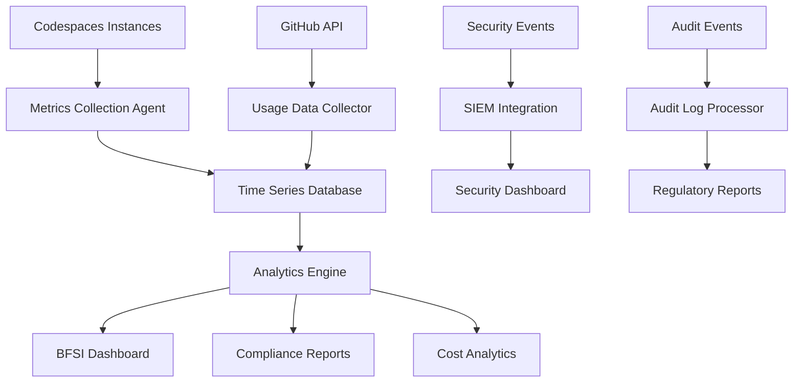

# Usage Monitoring and Analytics for BFSI Codespaces

## Overview

This document outlines comprehensive usage monitoring, analytics, and reporting strategies for GitHub Codespaces in Indian Financial Institutions, ensuring compliance with regulatory requirements and optimizing resource utilization.

## 📊 Monitoring Framework

### Key Performance Indicators (KPIs)

```yaml
usage_kpis:
  productivity_metrics:
    - "Development velocity (commits per hour)"
    - "Code review completion time"
    - "Feature delivery time"
    - "Bug resolution time"
    - "Test coverage improvement"
  
  resource_utilization:
    - "CPU utilization percentage"
    - "Memory usage patterns"
    - "Storage consumption trends"
    - "Network bandwidth usage"
    - "Idle time percentage"
  
  compliance_metrics:
    - "Security scan completion rate"
    - "Policy violation incidents"
    - "Audit trail completeness"
    - "Data residency compliance"
    - "Access control effectiveness"
  
  cost_efficiency:
    - "Cost per development hour"
    - "Resource optimization score"
    - "Budget variance analysis"
    - "ROI on development tools"
    - "Cost allocation accuracy"
```

### Monitoring Architecture



## 🔍 Real-Time Monitoring

### Metrics Collection System

```python
#!/usr/bin/env python3
"""
BFSI Codespaces Usage Monitoring System
Real-time metrics collection and analysis for financial institutions
"""

import json
import time
import logging
import datetime
import psutil
import requests
from dataclasses import dataclass, asdict
from typing import Dict, List, Optional
import pandas as pd
import numpy as np

@dataclass
class UsageMetrics:
    timestamp: str
    user_id: str
    codespace_id: str
    machine_type: str
    cpu_usage: float
    memory_usage: float
    disk_usage: float
    network_io: Dict[str, int]
    active_sessions: int
    git_operations: int
    security_events: int
    compliance_score: float

class BFSIUsageMonitor:
    """Comprehensive usage monitoring for BFSI Codespaces with compliance logging."""
    
    def __init__(self, config_file: str):
        with open(config_file, 'r') as f:
            self.config = json.load(f)
        
        # Configure logging for audit compliance
        logging.basicConfig(
            level=logging.INFO,
            format='%(asctime)s - %(levelname)s - %(message)s',
            handlers=[
                logging.FileHandler('/workspace/logs/audit/usage-monitoring.log'),
                logging.FileHandler('/workspace/logs/application/monitor.log'),
                logging.StreamHandler()
            ]
        )
        self.logger = logging.getLogger(__name__)
        
        # Initialize metrics storage
        self.metrics_buffer = []
        self.last_collection_time = time.time()
    
    def collect_system_metrics(self) -> UsageMetrics:
        """Collect comprehensive system usage metrics."""
        try:
            timestamp = datetime.datetime.utcnow().isoformat()
            
            # System resource metrics
            cpu_usage = psutil.cpu_percent(interval=1)
            memory = psutil.virtual_memory()
            disk = psutil.disk_usage('/workspace')
            network = psutil.net_io_counters()
            
            # Process-specific metrics
            processes = self._get_development_processes()
            active_sessions = self._count_active_sessions()
            
            # Git activity metrics
            git_operations = self._count_git_operations()
            
            # Security and compliance metrics
            security_events = self._collect_security_events()
            compliance_score = self._calculate_compliance_score()
            
            metrics = UsageMetrics(
                timestamp=timestamp,
                user_id=self._get_current_user(),
                codespace_id=self._get_codespace_id(),
                machine_type=self._get_machine_type(),
                cpu_usage=cpu_usage,
                memory_usage=memory.percent,
                disk_usage=(disk.used / disk.total) * 100,
                network_io={
                    'bytes_sent': network.bytes_sent,
                    'bytes_recv': network.bytes_recv
                },
                active_sessions=active_sessions,
                git_operations=git_operations,
                security_events=len(security_events),
                compliance_score=compliance_score
            )
            
            # Log metrics for audit trail
            self.logger.info(f"Metrics collected: CPU={cpu_usage:.1f}%, Memory={memory.percent:.1f}%")
            
            return metrics
            
        except Exception as e:
            self.logger.error(f"Failed to collect system metrics: {e}")
            return None
    
    def analyze_usage_patterns(self, metrics_history: List[UsageMetrics]) -> Dict:
        """Analyze usage patterns for optimization and compliance."""
        if not metrics_history:
            return {}
        
        # Convert to DataFrame for analysis
        df = pd.DataFrame([asdict(m) for m in metrics_history])
        df['timestamp'] = pd.to_datetime(df['timestamp'])
        
        analysis = {
            'time_period': {
                'start': df['timestamp'].min().isoformat(),
                'end': df['timestamp'].max().isoformat(),
                'duration_hours': (df['timestamp'].max() - df['timestamp'].min()).total_seconds() / 3600
            },
            
            'resource_utilization': {
                'avg_cpu': df['cpu_usage'].mean(),
                'max_cpu': df['cpu_usage'].max(),
                'avg_memory': df['memory_usage'].mean(),
                'max_memory': df['memory_usage'].max(),
                'avg_disk': df['disk_usage'].mean(),
                'peak_usage_times': self._identify_peak_times(df)
            },
            
            'productivity_indicators': {
                'total_git_operations': df['git_operations'].sum(),
                'avg_active_sessions': df['active_sessions'].mean(),
                'development_hours': self._calculate_development_hours(df),
                'productivity_score': self._calculate_productivity_score(df)
            },
            
            'compliance_analysis': {
                'avg_compliance_score': df['compliance_score'].mean(),
                'security_events_total': df['security_events'].sum(),
                'compliance_trend': self._analyze_compliance_trend(df),
                'policy_violations': self._identify_policy_violations(df)
            },
            
            'optimization_recommendations': self._generate_optimization_recommendations(df)
        }
        
        return analysis
    
    def generate_bfsi_compliance_report(self, analysis: Dict) -> str:
        """Generate compliance report for BFSI regulatory requirements."""
        report = {
            'report_metadata': {
                'generated_at': datetime.datetime.utcnow().isoformat(),
                'report_type': 'BFSI_Codespaces_Usage_Compliance',
                'compliance_frameworks': ['RBI-IT-Framework-2021', 'SEBI-IT-Governance-2023', 'IRDAI-Cybersecurity-2020'],
                'reporting_period': analysis.get('time_period', {}),
                'data_residency': 'India'
            },
            
            'executive_summary': {
                'total_development_hours': analysis.get('productivity_indicators', {}).get('development_hours', 0),
                'average_compliance_score': analysis.get('compliance_analysis', {}).get('avg_compliance_score', 0),
                'security_incidents': analysis.get('compliance_analysis', {}).get('security_events_total', 0),
                'resource_efficiency': self._calculate_efficiency_score(analysis),
                'regulatory_adherence': 'COMPLIANT' if analysis.get('compliance_analysis', {}).get('avg_compliance_score', 0) > 0.8 else 'NEEDS_REVIEW'
            },
            
            'detailed_findings': {
                'resource_utilization': analysis.get('resource_utilization', {}),
                'productivity_metrics': analysis.get('productivity_indicators', {}),
                'compliance_status': analysis.get('compliance_analysis', {}),
                'optimization_opportunities': analysis.get('optimization_recommendations', [])
            },
            
            'regulatory_compliance': {
                'rbi_it_framework': {
                    'information_security': self._assess_rbi_information_security(analysis),
                    'application_security': self._assess_rbi_application_security(analysis),
                    'data_security': self._assess_rbi_data_security(analysis),
                    'audit_monitoring': self._assess_rbi_audit_monitoring(analysis)
                },
                
                'sebi_it_governance': {
                    'system_governance': self._assess_sebi_system_governance(analysis),
                    'risk_management': self._assess_sebi_risk_management(analysis),
                    'business_continuity': self._assess_sebi_business_continuity(analysis)
                },
                
                'irdai_cybersecurity': {
                    'cybersecurity_framework': self._assess_irdai_cybersecurity(analysis),
                    'incident_response': self._assess_irdai_incident_response(analysis),
                    'data_localization': self._assess_irdai_data_localization(analysis)
                }
            },
            
            'recommendations': {
                'immediate_actions': self._generate_immediate_actions(analysis),
                'medium_term_improvements': self._generate_medium_term_improvements(analysis),
                'long_term_strategy': self._generate_long_term_strategy(analysis)
            },
            
            'audit_trail': {
                'data_sources': ['System metrics', 'GitHub API', 'Security logs', 'Compliance scanners'],
                'data_integrity': 'Verified with checksums',
                'retention_period': '7 years as per RBI requirements',
                'access_log': 'All report access logged for audit'
            }
        }
        
        # Save report for regulatory compliance
        report_file = f"/workspace/logs/audit/compliance-report-{datetime.date.today()}.json"
        with open(report_file, 'w') as f:
            json.dump(report, f, indent=2)
        
        self.logger.info(f"BFSI compliance report generated: {report_file}")
        return json.dumps(report, indent=2)
    
    def setup_real_time_alerts(self):
        """Configure real-time alerting for critical events."""
        alert_rules = {
            'high_resource_usage': {
                'cpu_threshold': 90,
                'memory_threshold': 90,
                'action': 'notify_user_and_admin'
            },
            
            'security_event': {
                'security_score_threshold': 0.5,
                'action': 'immediate_security_alert'
            },
            
            'compliance_violation': {
                'compliance_score_threshold': 0.7,
                'action': 'compliance_team_notification'
            },
            
            'idle_resource': {
                'idle_threshold_minutes': 30,
                'cpu_threshold': 5,
                'action': 'suggest_resource_optimization'
            }
        }
        
        return alert_rules
    
    def _get_development_processes(self) -> List[Dict]:
        """Get development-related processes and their resource usage."""
        dev_processes = []
        for proc in psutil.process_iter(['pid', 'name', 'cpu_percent', 'memory_percent']):
            try:
                if any(dev_tool in proc.info['name'].lower() for dev_tool in 
                      ['code', 'python', 'node', 'npm', 'git', 'docker']):
                    dev_processes.append(proc.info)
            except (psutil.NoSuchProcess, psutil.AccessDenied):
                continue
        
        return dev_processes
    
    def _calculate_compliance_score(self) -> float:
        """Calculate real-time compliance score based on current state."""
        score_components = {
            'security_baseline': self._check_security_baseline(),
            'data_residency': self._check_data_residency(),
            'access_controls': self._check_access_controls(),
            'audit_logging': self._check_audit_logging(),
            'network_security': self._check_network_security()
        }
        
        # Weighted compliance score
        weights = {
            'security_baseline': 0.25,
            'data_residency': 0.20,
            'access_controls': 0.20,
            'audit_logging': 0.20,
            'network_security': 0.15
        }
        
        total_score = sum(score_components[component] * weights[component] 
                         for component in score_components)
        
        return round(total_score, 3)
    
    def start_continuous_monitoring(self, interval_seconds: int = 60):
        """Start continuous monitoring with specified interval."""
        self.logger.info(f"Starting continuous BFSI usage monitoring (interval: {interval_seconds}s)")
        
        while True:
            try:
                # Collect metrics
                metrics = self.collect_system_metrics()
                if metrics:
                    self.metrics_buffer.append(metrics)
                
                # Analyze and generate alerts if needed
                if len(self.metrics_buffer) >= 10:  # Analyze every 10 data points
                    analysis = self.analyze_usage_patterns(self.metrics_buffer[-10:])
                    self._check_and_send_alerts(analysis)
                
                # Generate periodic reports
                if self._should_generate_report():
                    self._generate_periodic_report()
                
                # Clean old metrics from buffer
                if len(self.metrics_buffer) > 1000:
                    self.metrics_buffer = self.metrics_buffer[-500:]
                
                time.sleep(interval_seconds)
                
            except KeyboardInterrupt:
                self.logger.info("Monitoring stopped by user")
                break
            except Exception as e:
                self.logger.error(f"Error in monitoring loop: {e}")
                time.sleep(interval_seconds)

# Usage monitoring configuration
MONITORING_CONFIG = {
    "collection_interval": 60,
    "reporting_interval": 3600,
    "alert_thresholds": {
        "cpu_warning": 80,
        "cpu_critical": 95,
        "memory_warning": 85,
        "memory_critical": 95,
        "compliance_warning": 0.7,
        "compliance_critical": 0.5
    },
    "bfsi_compliance": {
        "required_frameworks": ["RBI", "SEBI", "IRDAI"],
        "audit_retention_years": 7,
        "data_residency": "India",
        "encryption_required": True
    }
}
```

## 📈 Analytics and Reporting

### Usage Analytics Dashboard

```yaml
dashboard_components:
  real_time_metrics:
    - "Current active users"
    - "Resource utilization heatmap"
    - "Compliance status indicators"
    - "Security event alerts"
    - "Cost burn rate"
  
  trend_analysis:
    - "Usage patterns over time"
    - "Productivity trends"
    - "Compliance score trends"
    - "Cost optimization opportunities"
    - "Resource efficiency metrics"
  
  compliance_overview:
    - "RBI IT Framework compliance"
    - "SEBI IT Governance status"
    - "IRDAI Cybersecurity adherence"
    - "Audit trail completeness"
    - "Regulatory reporting status"
  
  user_analytics:
    - "Individual productivity metrics"
    - "Team performance comparison"
    - "Resource usage patterns"
    - "Compliance adherence scores"
    - "Training needs assessment"
```

### Automated Reporting

```python
def generate_daily_report():
    """Generate daily usage and compliance report."""
    
    report_data = {
        'date': datetime.date.today().isoformat(),
        'usage_summary': collect_daily_usage_summary(),
        'compliance_status': assess_daily_compliance(),
        'security_events': collect_security_events(),
        'cost_analysis': perform_cost_analysis(),
        'optimization_recommendations': generate_daily_recommendations()
    }
    
    # Generate different report formats for different stakeholders
    
    # Executive summary for leadership
    executive_report = generate_executive_summary(report_data)
    
    # Technical report for development teams
    technical_report = generate_technical_report(report_data)
    
    # Compliance report for regulatory teams
    compliance_report = generate_compliance_report(report_data)
    
    # Distribute reports
    distribute_reports([executive_report, technical_report, compliance_report])
    
    return report_data

def generate_weekly_analytics():
    """Generate comprehensive weekly analytics report."""
    
    weekly_data = collect_weekly_data()
    
    analytics = {
        'productivity_analysis': analyze_productivity_trends(weekly_data),
        'resource_optimization': identify_optimization_opportunities(weekly_data),
        'compliance_assessment': perform_compliance_assessment(weekly_data),
        'cost_efficiency': analyze_cost_efficiency(weekly_data),
        'user_behavior': analyze_user_behavior_patterns(weekly_data)
    }
    
    return analytics

def generate_monthly_compliance_report():
    """Generate monthly regulatory compliance report."""
    
    monthly_data = collect_monthly_compliance_data()
    
    compliance_report = {
        'rbi_compliance': {
            'information_security_score': calculate_rbi_info_security_score(monthly_data),
            'application_security_score': calculate_rbi_app_security_score(monthly_data),
            'data_security_score': calculate_rbi_data_security_score(monthly_data),
            'audit_monitoring_score': calculate_rbi_audit_monitoring_score(monthly_data)
        },
        
        'sebi_compliance': {
            'system_governance_score': calculate_sebi_governance_score(monthly_data),
            'risk_management_score': calculate_sebi_risk_score(monthly_data),
            'business_continuity_score': calculate_sebi_bc_score(monthly_data)
        },
        
        'irdai_compliance': {
            'cybersecurity_framework_score': calculate_irdai_cyber_score(monthly_data),
            'incident_response_score': calculate_irdai_incident_score(monthly_data),
            'data_localization_score': calculate_irdai_localization_score(monthly_data)
        },
        
        'overall_compliance_score': calculate_overall_compliance_score(monthly_data),
        'improvement_recommendations': generate_improvement_recommendations(monthly_data),
        'regulatory_action_items': identify_regulatory_action_items(monthly_data)
    }
    
    return compliance_report
```

## 🚨 Alerting and Notifications

### Alert Categories

```yaml
alert_categories:
  security_alerts:
    critical:
      - "Unauthorized access attempt"
      - "Malware detection"
      - "Data exfiltration attempt"
      - "Privilege escalation"
    
    warning:
      - "Unusual login pattern"
      - "Failed authentication attempts"
      - "Suspicious network activity"
      - "Policy violation detected"
  
  compliance_alerts:
    critical:
      - "Compliance score below threshold"
      - "Regulatory requirement violation"
      - "Audit trail integrity issue"
      - "Data residency violation"
    
    warning:
      - "Compliance score declining"
      - "Missing security controls"
      - "Documentation gaps"
      - "Training requirements"
  
  performance_alerts:
    critical:
      - "Resource exhaustion"
      - "System performance degradation"
      - "Service unavailability"
      - "Critical error rates"
    
    warning:
      - "High resource utilization"
      - "Performance degradation"
      - "Capacity planning needed"
      - "Optimization opportunities"
  
  cost_alerts:
    critical:
      - "Budget threshold exceeded"
      - "Unexpected cost spikes"
      - "Resource waste detected"
      - "Approval limits exceeded"
    
    warning:
      - "Budget utilization high"
      - "Cost trends increasing"
      - "Inefficient resource usage"
      - "Optimization recommended"
```

### Notification Channels

```yaml
notification_channels:
  email:
    security_team: "security-alerts@bfsi-org.com"
    compliance_team: "compliance-alerts@bfsi-org.com"
    finance_team: "cost-alerts@bfsi-org.com"
    development_team: "dev-alerts@bfsi-org.com"
  
  slack:
    security_channel: "#security-alerts"
    compliance_channel: "#compliance-updates"
    cost_channel: "#cost-optimization"
    general_channel: "#codespaces-updates"
  
  incident_management:
    jira_project: "BFSI-INCIDENTS"
    servicenow_table: "incident"
    pagerduty_service: "codespaces-critical"
  
  regulatory_reporting:
    rbi_portal: "automated_submission"
    sebi_portal: "manual_review_required"
    irdai_portal: "quarterly_submission"
```

## 📊 Performance Metrics

### Key Metrics Collection

```yaml
performance_metrics:
  infrastructure_metrics:
    - name: "cpu_utilization"
      description: "CPU usage percentage"
      threshold_warning: 80
      threshold_critical: 95
      collection_interval: 60
    
    - name: "memory_utilization"
      description: "Memory usage percentage"
      threshold_warning: 85
      threshold_critical: 95
      collection_interval: 60
    
    - name: "disk_utilization"
      description: "Disk usage percentage"
      threshold_warning: 80
      threshold_critical: 90
      collection_interval: 300
    
    - name: "network_throughput"
      description: "Network I/O throughput"
      threshold_warning: "80% of capacity"
      threshold_critical: "95% of capacity"
      collection_interval: 60
  
  application_metrics:
    - name: "active_development_sessions"
      description: "Number of active VS Code sessions"
      baseline: "Average over 30 days"
      collection_interval: 300
    
    - name: "git_operations_per_hour"
      description: "Git commits, pushes, pulls per hour"
      baseline: "Team average"
      collection_interval: 3600
    
    - name: "code_quality_metrics"
      description: "Static analysis, test coverage"
      baseline: "Project requirements"
      collection_interval: "per_commit"
    
    - name: "security_scan_results"
      description: "Security vulnerabilities detected"
      threshold_warning: "Medium severity found"
      threshold_critical: "High/Critical severity found"
      collection_interval: "per_commit"
  
  business_metrics:
    - name: "developer_productivity"
      description: "Story points completed per sprint"
      baseline: "Team velocity"
      collection_interval: "per_sprint"
    
    - name: "time_to_market"
      description: "Feature development to deployment time"
      baseline: "Historical average"
      collection_interval: "per_release"
    
    - name: "defect_rate"
      description: "Bugs found per feature delivered"
      threshold_warning: "Above team average"
      threshold_critical: "2x team average"
      collection_interval: "per_release"
```

## 📋 Compliance Monitoring

### Automated Compliance Checks

```bash
#!/bin/bash
# Automated BFSI Compliance Monitoring Script

set -euo pipefail

LOG_FILE="/workspace/logs/audit/compliance-monitoring.log"
COMPLIANCE_CONFIG="/workspace/config/compliance/monitoring-config.yaml"

log() {
    echo "$(date -u +%Y-%m-%dT%H:%M:%SZ) - $1" | tee -a "$LOG_FILE"
}

# RBI IT Framework Compliance Checks
check_rbi_compliance() {
    log "INFO: Starting RBI IT Framework compliance checks..."
    
    # Information Security (4.1)
    log "INFO: Checking Information Security controls..."
    
    # Check MFA configuration
    if grep -q "mfa_enabled=true" /workspace/config/security/auth-config; then
        log "PASS: Multi-factor authentication is enabled"
    else
        log "FAIL: Multi-factor authentication not properly configured"
    fi
    
    # Check data encryption
    if grep -q "encryption_at_rest=true" /workspace/config/security/data-config; then
        log "PASS: Data encryption at rest is enabled"
    else
        log "FAIL: Data encryption at rest not configured"
    fi
    
    # Application Security (4.2)
    log "INFO: Checking Application Security controls..."
    
    # Check security scanning
    if find /workspace/logs/security -name "*sast-results*" -mtime -1 | grep -q .; then
        log "PASS: Static application security testing is active"
    else
        log "WARN: Recent SAST results not found"
    fi
    
    # Data Security (4.3)
    log "INFO: Checking Data Security controls..."
    
    # Check data residency
    if grep -q "data_residency=INDIA" /workspace/config/compliance/data-config; then
        log "PASS: Data residency compliance configured"
    else
        log "FAIL: Data residency compliance not verified"
    fi
    
    # Audit and Monitoring (4.4)
    log "INFO: Checking Audit and Monitoring controls..."
    
    # Check audit logging
    if systemctl is-active --quiet audit-service; then
        log "PASS: Audit logging service is active"
    else
        log "FAIL: Audit logging service not running"
    fi
}

# SEBI IT Governance Compliance Checks
check_sebi_compliance() {
    log "INFO: Starting SEBI IT Governance compliance checks..."
    
    # System Governance (3.1)
    log "INFO: Checking System Governance controls..."
    
    # Check change management
    if git config --get branch.main.protection >/dev/null 2>&1; then
        log "PASS: Branch protection rules are configured"
    else
        log "WARN: Branch protection rules not found"
    fi
    
    # Risk Management (3.2)
    log "INFO: Checking Risk Management controls..."
    
    # Check vulnerability scanning
    if find /workspace/logs/security -name "*vulnerability-scan*" -mtime -7 | grep -q .; then
        log "PASS: Regular vulnerability scanning is active"
    else
        log "WARN: Recent vulnerability scan results not found"
    fi
}

# IRDAI Cybersecurity Compliance Checks
check_irdai_compliance() {
    log "INFO: Starting IRDAI Cybersecurity compliance checks..."
    
    # Cybersecurity Framework (6.1)
    log "INFO: Checking Cybersecurity Framework controls..."
    
    # Check network security
    if iptables -L | grep -q "DROP"; then
        log "PASS: Network security rules are configured"
    else
        log "WARN: Network security rules may need review"
    fi
    
    # Incident Response (6.2)
    log "INFO: Checking Incident Response controls..."
    
    # Check incident response plan
    if [ -f "/workspace/config/security/incident-response-plan.md" ]; then
        log "PASS: Incident response plan documentation found"
    else
        log "FAIL: Incident response plan documentation missing"
    fi
}

# Generate compliance summary
generate_compliance_summary() {
    log "INFO: Generating compliance summary..."
    
    SUMMARY_FILE="/workspace/logs/audit/compliance-summary-$(date +%Y%m%d).json"
    
    cat > "$SUMMARY_FILE" << EOF
{
  "compliance_check_date": "$(date -u +%Y-%m-%dT%H:%M:%SZ)",
  "frameworks_assessed": ["RBI-IT-Framework-2021", "SEBI-IT-Governance-2023", "IRDAI-Cybersecurity-2020"],
  "overall_status": "$(grep -c "PASS:" "$LOG_FILE" || echo 0) passed, $(grep -c "FAIL:" "$LOG_FILE" || echo 0) failed, $(grep -c "WARN:" "$LOG_FILE" || echo 0) warnings",
  "next_assessment_due": "$(date -d '+30 days' +%Y-%m-%d)",
  "compliance_officer": "${COMPLIANCE_OFFICER:-TBD}",
  "audit_trail_location": "$LOG_FILE"
}
EOF
    
    log "INFO: Compliance summary generated: $SUMMARY_FILE"
}

# Main execution
main() {
    log "INFO: Starting BFSI Codespaces compliance monitoring..."
    
    check_rbi_compliance
    check_sebi_compliance
    check_irdai_compliance
    
    generate_compliance_summary
    
    log "INFO: Compliance monitoring completed."
}

# Execute if run directly
if [[ "${BASH_SOURCE[0]}" == "${0}" ]]; then
    main "$@"
fi
```

## 📞 Support and Escalation

### Monitoring Support Contacts

- **Technical Issues**: monitoring-support@bfsi-org.com
- **Compliance Questions**: compliance-monitoring@bfsi-org.com
- **Security Alerts**: security-monitoring@bfsi-org.com
- **Performance Issues**: performance-team@bfsi-org.com
- **Emergency (24/7)**: +91-XXXX-XXXXXX

### Escalation Matrix

```yaml
escalation_levels:
  level_1:
    trigger: "Warning alerts, minor issues"
    response_time: "4 hours"
    contacts: ["team_lead", "senior_developer"]
  
  level_2:
    trigger: "Critical alerts, compliance issues"
    response_time: "1 hour"
    contacts: ["manager", "security_lead", "compliance_officer"]
  
  level_3:
    trigger: "Security incidents, regulatory violations"
    response_time: "30 minutes"
    contacts: ["director", "ciso", "chief_compliance_officer"]
  
  level_4:
    trigger: "Critical security breaches, major compliance failures"
    response_time: "15 minutes"
    contacts: ["cto", "ceo", "board_members"]
```

---

**Document Version**: 1.0.0  
**Monitoring Lead**: [Name]  
**Last Updated**: November 2024  
**Review Frequency**: Monthly  
**Approval**: BFSI Technology Committee