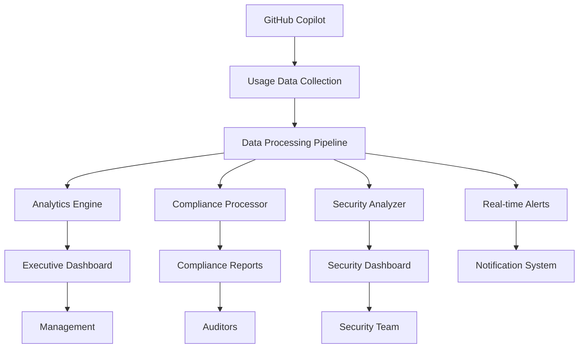

# Usage Analytics and Reporting Dashboard

This guide provides comprehensive usage analytics and reporting solutions for GitHub Copilot Business in BFSI environments, enabling data-driven insights for productivity, compliance, and security monitoring.

## 🏛️ Overview

Usage analytics for Copilot in BFSI environments must address:
- **Productivity Metrics**: Developer efficiency and code quality improvements
- **Compliance Reporting**: Regulatory audit requirements and usage tracking
- **Security Analytics**: Risk assessment and security incident correlation
- **Cost Optimization**: Usage patterns and ROI analysis
- **Training Insights**: Skill development and adoption patterns

## 📊 Analytics Architecture



## 🔧 Implementation Components

### Data Collection Service

```java
// Context: Comprehensive Copilot usage data collection for BFSI analytics
// Domain: Financial services developer productivity and compliance
// Security: Encrypted data collection, PII protection
// Compliance: RBI audit requirements, data retention policies

@Service
@Slf4j
public class CopilotUsageCollectionService {
    
    private final UsageEventRepository usageEventRepository;
    private final EncryptionService encryptionService;
    private final ComplianceProcessor complianceProcessor;
    private final SecurityAnalyzer securityAnalyzer;
    private final KafkaTemplate<String, UsageEvent> kafkaTemplate;
    
    @EventListener
    @Async("usageAnalyticsExecutor")
    public void collectUsageEvent(CopilotUsageEvent event) {
        try {
            // Create comprehensive usage record
            UsageEvent usageEvent = UsageEvent.builder()
                .eventId(UUID.randomUUID().toString())
                .userId(event.getUserId())
                .userEmail(hashEmail(event.getUserEmail()))
                .repository(event.getRepository())
                .filePath(sanitizeFilePath(event.getFilePath()))
                .language(event.getLanguage())
                .eventType(event.getEventType())
                .timestamp(Instant.now())
                .sessionId(event.getSessionId())
                .suggestionCount(event.getSuggestionCount())
                .acceptedSuggestions(event.getAcceptedSuggestions())
                .rejectedSuggestions(event.getRejectedSuggestions())
                .linesOfCode(event.getLinesOfCode())
                .characterCount(event.getCharacterCount())
                .completionTime(event.getCompletionTime())
                .userAgent(event.getUserAgent())
                .ipAddress(hashIpAddress(event.getIpAddress()))
                .build();
            
            // Add security context
            SecurityContext securityContext = extractSecurityContext(event);
            usageEvent.setSecurityContext(securityContext);
            
            // Add compliance metadata
            ComplianceMetadata complianceMetadata = complianceProcessor.process(event);
            usageEvent.setComplianceMetadata(complianceMetadata);
            
            // Store usage event
            usageEventRepository.save(usageEvent);
            
            // Send to real-time analytics pipeline
            kafkaTemplate.send("copilot-usage-events", usageEvent.getUserId(), usageEvent);
            
            // Trigger real-time analysis
            analyzeUsagePatterns(usageEvent);
            
            log.debug("Usage event collected: {}", usageEvent.getEventId());
            
        } catch (Exception e) {
            log.error("Failed to collect usage event", e);
            // Send to dead letter queue for retry
            handleCollectionFailure(event, e);
        }
    }
    
    @Scheduled(fixedRate = 300000) // Every 5 minutes
    public void aggregateUsageMetrics() {
        try {
            Instant now = Instant.now();
            Instant fiveMinutesAgo = now.minus(Duration.ofMinutes(5));
            
            // Aggregate metrics for the last 5 minutes
            UsageAggregation aggregation = aggregateUsageData(fiveMinutesAgo, now);
            
            // Store aggregated metrics
            usageAggregationRepository.save(aggregation);
            
            // Send to monitoring systems
            sendMetricsToMonitoring(aggregation);
            
        } catch (Exception e) {
            log.error("Failed to aggregate usage metrics", e);
        }
    }
    
    private void analyzeUsagePatterns(UsageEvent event) {
        // Real-time pattern analysis
        UsagePattern pattern = patternAnalyzer.analyze(event);
        
        if (pattern.isAnomalous()) {
            triggerAnomalyAlert(event, pattern);
        }
        
        if (pattern.isSecurityConcern()) {
            triggerSecurityAlert(event, pattern);
        }
        
        if (pattern.isComplianceIssue()) {
            triggerComplianceAlert(event, pattern);
        }
    }
    
    private String hashEmail(String email) {
        // Hash email for privacy while maintaining analytics capability
        return DigestUtils.sha256Hex(email + "salt");
    }
    
    private String hashIpAddress(String ipAddress) {
        // Hash IP address for privacy
        return DigestUtils.sha256Hex(ipAddress + "ip_salt");
    }
    
    private String sanitizeFilePath(String filePath) {
        // Remove sensitive path information while keeping analytics value
        if (filePath.contains("/secrets/") || filePath.contains("/credentials/")) {
            return "[SENSITIVE_PATH]";
        }
        // Replace user-specific paths with generic patterns
        return filePath.replaceAll("/users/[^/]+/", "/users/[USER]/");
    }
}

/**
 * Usage Event Data Model
 */
@Entity
@Table(name = "copilot_usage_events")
@Data
@Builder
@NoArgsConstructor
@AllArgsConstructor
public class UsageEvent {
    
    @Id
    private String eventId;
    
    @Column(name = "user_id")
    private String userId;
    
    @Column(name = "user_email_hash")
    private String userEmailHash;
    
    @Column(name = "repository")
    private String repository;
    
    @Column(name = "file_path")
    private String filePath;
    
    @Column(name = "language")
    private String language;
    
    @Enumerated(EnumType.STRING)
    @Column(name = "event_type")
    private UsageEventType eventType;
    
    @Column(name = "timestamp")
    private Instant timestamp;
    
    @Column(name = "session_id")
    private String sessionId;
    
    @Column(name = "suggestion_count")
    private Integer suggestionCount;
    
    @Column(name = "accepted_suggestions")
    private Integer acceptedSuggestions;
    
    @Column(name = "rejected_suggestions")
    private Integer rejectedSuggestions;
    
    @Column(name = "lines_of_code")
    private Integer linesOfCode;
    
    @Column(name = "character_count")
    private Integer characterCount;
    
    @Column(name = "completion_time_ms")
    private Long completionTime;
    
    @Column(name = "user_agent")
    private String userAgent;
    
    @Column(name = "ip_address_hash")
    private String ipAddressHash;
    
    @Embedded
    private SecurityContext securityContext;
    
    @Embedded
    private ComplianceMetadata complianceMetadata;
}

enum UsageEventType {
    SUGGESTION_GENERATED,
    SUGGESTION_ACCEPTED,
    SUGGESTION_REJECTED,
    CHAT_INTERACTION,
    CODE_EXPLANATION,
    CODE_REFACTORING,
    TEST_GENERATION,
    DOCUMENTATION_GENERATION
}
```

### Analytics Dashboard Service

```java
// Context: Comprehensive analytics dashboard for BFSI Copilot usage
// Domain: Executive insights, compliance reporting, security monitoring
// Features: Real-time dashboards, historical analysis, predictive insights
// Compliance: Audit-ready reports, regulatory compliance tracking

@RestController
@RequestMapping("/api/analytics/copilot")
@PreAuthorize("hasRole('ANALYTICS_VIEWER')")
public class CopilotAnalyticsController {
    
    private final AnalyticsService analyticsService;
    private final ComplianceReportingService complianceReporting;
    private final SecurityAnalyticsService securityAnalytics;
    private final ProductivityAnalyticsService productivityAnalytics;
    
    @GetMapping("/dashboard/executive")
    @PreAuthorize("hasRole('EXECUTIVE')")
    public ResponseEntity<ExecutiveDashboard> getExecutiveDashboard(
            @RequestParam @DateTimeFormat(iso = DateTimeFormat.ISO.DATE) LocalDate from,
            @RequestParam @DateTimeFormat(iso = DateTimeFormat.ISO.DATE) LocalDate to) {
        
        ExecutiveDashboard dashboard = ExecutiveDashboard.builder()
            .dateRange(DateRange.of(from, to))
            .totalUsers(analyticsService.getTotalActiveUsers(from, to))
            .totalSuggestions(analyticsService.getTotalSuggestions(from, to))
            .acceptanceRate(analyticsService.getAcceptanceRate(from, to))
            .productivityGains(productivityAnalytics.calculateProductivityGains(from, to))
            .costSavings(analyticsService.calculateCostSavings(from, to))
            .complianceScore(complianceReporting.getComplianceScore(from, to))
            .securityScore(securityAnalytics.getSecurityScore(from, to))
            .topLanguages(analyticsService.getTopLanguages(from, to))
            .departmentUsage(analyticsService.getDepartmentUsage(from, to))
            .trendData(analyticsService.getTrendData(from, to))
            .build();
        
        return ResponseEntity.ok(dashboard);
    }
    
    @GetMapping("/dashboard/security")
    @PreAuthorize("hasRole('SECURITY_ANALYST')")
    public ResponseEntity<SecurityDashboard> getSecurityDashboard(
            @RequestParam @DateTimeFormat(iso = DateTimeFormat.ISO.DATE) LocalDate from,
            @RequestParam @DateTimeFormat(iso = DateTimeFormat.ISO.DATE) LocalDate to) {
        
        SecurityDashboard dashboard = SecurityDashboard.builder()
            .dateRange(DateRange.of(from, to))
            .securityAlerts(securityAnalytics.getSecurityAlerts(from, to))
            .vulnerabilityDetections(securityAnalytics.getVulnerabilityDetections(from, to))
            .sensitiveDataExposures(securityAnalytics.getSensitiveDataExposures(from, to))
            .anomalousUsagePatterns(securityAnalytics.getAnomalousPatterns(from, to))
            .riskScore(securityAnalytics.calculateRiskScore(from, to))
            .ipProtectionTriggers(securityAnalytics.getIpProtectionTriggers(from, to))
            .contentFilteringEvents(securityAnalytics.getContentFilteringEvents(from, to))
            .userRiskProfiles(securityAnalytics.getUserRiskProfiles(from, to))
            .build();
        
        return ResponseEntity.ok(dashboard);
    }
    
    @GetMapping("/dashboard/compliance")
    @PreAuthorize("hasRole('COMPLIANCE_OFFICER')")
    public ResponseEntity<ComplianceDashboard> getComplianceDashboard(
            @RequestParam @DateTimeFormat(iso = DateTimeFormat.ISO.DATE) LocalDate from,
            @RequestParam @DateTimeFormat(iso = DateTimeFormat.ISO.DATE) LocalDate to) {
        
        ComplianceDashboard dashboard = ComplianceDashboard.builder()
            .dateRange(DateRange.of(from, to))
            .auditTrailCompleteness(complianceReporting.getAuditTrailCompleteness(from, to))
            .policyViolations(complianceReporting.getPolicyViolations(from, to))
            .dataRetentionCompliance(complianceReporting.getDataRetentionCompliance(from, to))
            .regulatoryMapping(complianceReporting.getRegulatoryMapping(from, to))
            .accessControlCompliance(complianceReporting.getAccessControlCompliance(from, to))
            .ipProtectionStatus(complianceReporting.getIpProtectionStatus(from, to))
            .auditReadiness(complianceReporting.getAuditReadiness(from, to))
            .build();
        
        return ResponseEntity.ok(dashboard);
    }
    
    @GetMapping("/reports/productivity")
    @PreAuthorize("hasRole('MANAGER')")
    public ResponseEntity<ProductivityReport> getProductivityReport(
            @RequestParam @DateTimeFormat(iso = DateTimeFormat.ISO.DATE) LocalDate from,
            @RequestParam @DateTimeFormat(iso = DateTimeFormat.ISO.DATE) LocalDate to,
            @RequestParam(required = false) String department,
            @RequestParam(required = false) String team) {
        
        ProductivityReportRequest request = ProductivityReportRequest.builder()
            .dateRange(DateRange.of(from, to))
            .department(department)
            .team(team)
            .build();
        
        ProductivityReport report = productivityAnalytics.generateProductivityReport(request);
        
        return ResponseEntity.ok(report);
    }
    
    @GetMapping("/reports/compliance/monthly")
    @PreAuthorize("hasRole('COMPLIANCE_OFFICER')")
    public ResponseEntity<byte[]> generateMonthlyComplianceReport(
            @RequestParam int year,
            @RequestParam int month) {
        
        YearMonth yearMonth = YearMonth.of(year, month);
        byte[] reportData = complianceReporting.generateMonthlyReport(yearMonth);
        
        HttpHeaders headers = new HttpHeaders();
        headers.setContentType(MediaType.APPLICATION_PDF);
        headers.setContentDisposition(ContentDisposition.builder("attachment")
            .filename("copilot-compliance-report-" + yearMonth + ".pdf")
            .build());
        
        return ResponseEntity.ok()
            .headers(headers)
            .body(reportData);
    }
    
    @GetMapping("/metrics/real-time")
    @PreAuthorize("hasRole('OPERATOR')")
    public ResponseEntity<RealTimeMetrics> getRealTimeMetrics() {
        
        RealTimeMetrics metrics = RealTimeMetrics.builder()
            .timestamp(Instant.now())
            .activeUsers(analyticsService.getCurrentActiveUsers())
            .suggestionsPerMinute(analyticsService.getSuggestionsPerMinute())
            .acceptanceRate(analyticsService.getCurrentAcceptanceRate())
            .averageResponseTime(analyticsService.getAverageResponseTime())
            .errorRate(analyticsService.getCurrentErrorRate())
            .securityAlerts(securityAnalytics.getActiveSecurityAlerts())
            .systemHealth(analyticsService.getSystemHealth())
            .build();
        
        return ResponseEntity.ok(metrics);
    }
}
```

### Productivity Analytics Engine

```java
// Context: Developer productivity analysis with Copilot in BFSI environment
// Domain: Code quality, development velocity, skill improvement
// Metrics: Lines of code, completion time, error reduction
// ROI: Cost savings, efficiency gains, training effectiveness

@Service
public class ProductivityAnalyticsService {
    
    private final UsageEventRepository usageEventRepository;
    private final CodeQualityService codeQualityService;
    private final DeveloperMetricsService developerMetricsService;
    private final TrainingAnalyticsService trainingAnalyticsService;
    
    public ProductivityGains calculateProductivityGains(LocalDate from, LocalDate to) {
        
        // Get baseline metrics (pre-Copilot)
        BaselineMetrics baseline = getBaselineMetrics(from, to);
        
        // Get current metrics (with Copilot)
        CurrentMetrics current = getCurrentMetrics(from, to);
        
        return ProductivityGains.builder()
            .codeCompletionImprovement(calculateCompletionImprovement(baseline, current))
            .developmentVelocityIncrease(calculateVelocityIncrease(baseline, current))
            .codeQualityImprovement(calculateQualityImprovement(baseline, current))
            .errorReduction(calculateErrorReduction(baseline, current))
            .learningAcceleration(calculateLearningAcceleration(baseline, current))
            .timeToMarketImprovement(calculateTimeToMarketImprovement(baseline, current))
            .build();
    }
    
    public DeveloperEfficiencyReport generateDeveloperEfficiencyReport(
            DeveloperEfficiencyRequest request) {
        
        List<UsageEvent> events = usageEventRepository.findByDateRangeAndFilters(
            request.getDateRange(), request.getFilters());
        
        Map<String, DeveloperMetrics> developerMetrics = events.stream()
            .collect(Collectors.groupingBy(
                UsageEvent::getUserId,
                Collectors.collectingAndThen(
                    Collectors.toList(),
                    this::calculateDeveloperMetrics
                )
            ));
        
        return DeveloperEfficiencyReport.builder()
            .reportPeriod(request.getDateRange())
            .totalDevelopers(developerMetrics.size())
            .averageEfficiencyGain(calculateAverageEfficiencyGain(developerMetrics))
            .topPerformers(getTopPerformers(developerMetrics))
            .improvementOpportunities(identifyImprovementOpportunities(developerMetrics))
            .skillDevelopmentInsights(trainingAnalyticsService.analyzeSkillDevelopment(events))
            .departmentComparison(analyzeDepartmentComparison(developerMetrics))
            .technologyAdoption(analyzeTechnologyAdoption(events))
            .build();
    }
    
    private DeveloperMetrics calculateDeveloperMetrics(List<UsageEvent> events) {
        return DeveloperMetrics.builder()
            .totalSuggestions(events.stream().mapToInt(UsageEvent::getSuggestionCount).sum())
            .acceptedSuggestions(events.stream().mapToInt(UsageEvent::getAcceptedSuggestions).sum())
            .rejectedSuggestions(events.stream().mapToInt(UsageEvent::getRejectedSuggestions).sum())
            .acceptanceRate(calculateAcceptanceRate(events))
            .averageCompletionTime(calculateAverageCompletionTime(events))
            .linesOfCodeGenerated(events.stream().mapToInt(UsageEvent::getLinesOfCode).sum())
            .languageDistribution(calculateLanguageDistribution(events))
            .productivityScore(calculateProductivityScore(events))
            .qualityScore(calculateQualityScore(events))
            .innovationScore(calculateInnovationScore(events))
            .collaborationScore(calculateCollaborationScore(events))
            .build();
    }
    
    public CostSavingsAnalysis calculateCostSavings(LocalDate from, LocalDate to) {
        
        List<UsageEvent> events = usageEventRepository.findByDateRange(
            from.atStartOfDay().toInstant(ZoneOffset.UTC),
            to.atTime(LocalTime.MAX).toInstant(ZoneOffset.UTC));
        
        // Calculate time savings
        Duration totalTimeSaved = calculateTimeSavings(events);
        
        // Calculate cost per developer hour
        BigDecimal costPerHour = getDeveloperCostPerHour();
        
        // Calculate direct cost savings
        BigDecimal directSavings = costPerHour.multiply(
            new BigDecimal(totalTimeSaved.toHours()));
        
        // Calculate indirect savings (reduced errors, faster debugging)
        BigDecimal indirectSavings = calculateIndirectSavings(events);
        
        // Calculate quality improvements value
        BigDecimal qualitySavings = calculateQualitySavings(events);
        
        return CostSavingsAnalysis.builder()
            .reportPeriod(DateRange.of(from, to))
            .totalTimeSavedHours(totalTimeSaved.toHours())
            .directCostSavings(directSavings)
            .indirectCostSavings(indirectSavings)
            .qualityImprovementSavings(qualitySavings)
            .totalSavings(directSavings.add(indirectSavings).add(qualitySavings))
            .roi(calculateROI(directSavings, indirectSavings, qualitySavings))
            .paybackPeriod(calculatePaybackPeriod(directSavings, indirectSavings, qualitySavings))
            .departmentBreakdown(calculateDepartmentBreakdown(events))
            .projectedAnnualSavings(projectAnnualSavings(directSavings, indirectSavings, qualitySavings))
            .build();
    }
    
    private Duration calculateTimeSavings(List<UsageEvent> events) {
        return events.stream()
            .filter(event -> event.getEventType() == UsageEventType.SUGGESTION_ACCEPTED)
            .map(this::estimateTimeSavedPerSuggestion)
            .reduce(Duration.ZERO, Duration::plus);
    }
    
    private Duration estimateTimeSavedPerSuggestion(UsageEvent event) {
        // Estimate time saved based on lines of code, complexity, and language
        int linesOfCode = event.getLinesOfCode();
        String language = event.getLanguage();
        
        // Base time estimation: 2 minutes per line for manual coding
        Duration baseTime = Duration.ofMinutes(linesOfCode * 2);
        
        // Adjust based on language complexity
        double complexityMultiplier = getLanguageComplexityMultiplier(language);
        
        // Estimate Copilot saved 60-80% of development time
        double savingsMultiplier = 0.7; // 70% average savings
        
        return baseTime.multipliedBy((long) (complexityMultiplier * savingsMultiplier));
    }
    
    private double getLanguageComplexityMultiplier(String language) {
        return switch (language.toLowerCase()) {
            case "java", "c#", "scala" -> 1.2;
            case "python", "javascript" -> 1.0;
            case "go", "rust" -> 1.1;
            case "sql" -> 0.8;
            case "yaml", "json" -> 0.5;
            default -> 1.0;
        };
    }
}
```

### Compliance Reporting Engine

```java
// Context: Regulatory compliance reporting for BFSI Copilot usage
// Domain: RBI, SEBI, IRDAI audit requirements
// Features: Automated report generation, audit trail validation
// Compliance: Data retention, access controls, usage tracking

@Service
public class ComplianceReportingService {
    
    private final AuditTrailRepository auditTrailRepository;
    private final UsageEventRepository usageEventRepository;
    private final PolicyViolationRepository policyViolationRepository;
    private final ReportGenerationService reportGenerationService;
    
    public ComplianceScore getComplianceScore(LocalDate from, LocalDate to) {
        
        // Calculate audit trail completeness
        double auditTrailScore = calculateAuditTrailCompleteness(from, to);
        
        // Calculate policy compliance
        double policyComplianceScore = calculatePolicyCompliance(from, to);
        
        // Calculate access control compliance
        double accessControlScore = calculateAccessControlCompliance(from, to);
        
        // Calculate data protection compliance
        double dataProtectionScore = calculateDataProtectionCompliance(from, to);
        
        // Calculate IP protection compliance
        double ipProtectionScore = calculateIpProtectionCompliance(from, to);
        
        // Weighted overall score
        double overallScore = (auditTrailScore * 0.25) +
                             (policyComplianceScore * 0.25) +
                             (accessControlScore * 0.2) +
                             (dataProtectionScore * 0.15) +
                             (ipProtectionScore * 0.15);
        
        return ComplianceScore.builder()
            .overallScore(overallScore)
            .auditTrailScore(auditTrailScore)
            .policyComplianceScore(policyComplianceScore)
            .accessControlScore(accessControlScore)
            .dataProtectionScore(dataProtectionScore)
            .ipProtectionScore(ipProtectionScore)
            .reportDate(LocalDate.now())
            .evaluationPeriod(DateRange.of(from, to))
            .recommendations(generateComplianceRecommendations(overallScore))
            .build();
    }
    
    public byte[] generateMonthlyReport(YearMonth month) {
        
        LocalDate from = month.atDay(1);
        LocalDate to = month.atEndOfMonth();
        
        MonthlyComplianceReport report = MonthlyComplianceReport.builder()
            .reportMonth(month)
            .generatedDate(LocalDate.now())
            .executiveSummary(generateExecutiveSummary(from, to))
            .usageStatistics(generateUsageStatistics(from, to))
            .complianceMetrics(generateComplianceMetrics(from, to))
            .securityEvents(generateSecurityEvents(from, to))
            .policyViolations(generatePolicyViolations(from, to))
            .auditTrail(generateAuditTrail(from, to))
            .recommendations(generateRecommendations(from, to))
            .appendices(generateAppendices(from, to))
            .build();
        
        return reportGenerationService.generatePdfReport(report);
    }
    
    public AuditReadinessReport generateAuditReadinessReport() {
        
        LocalDate now = LocalDate.now();
        LocalDate sixMonthsAgo = now.minusMonths(6);
        
        return AuditReadinessReport.builder()
            .reportDate(now)
            .evaluationPeriod(DateRange.of(sixMonthsAgo, now))
            .dataRetentionCompliance(validateDataRetention())
            .auditTrailIntegrity(validateAuditTrailIntegrity())
            .accessControlDocumentation(validateAccessControlDocumentation())
            .policyDocumentation(validatePolicyDocumentation())
            .incidentResponseDocumentation(validateIncidentResponseDocumentation())
            .complianceTrainingRecords(validateComplianceTrainingRecords())
            .regulatoryMappingDocumentation(validateRegulatoryMapping())
            .overallReadinessScore(calculateOverallReadinessScore())
            .criticalGaps(identifyCriticalGaps())
            .actionPlan(generateActionPlan())
            .estimatedRemediationTime(estimateRemediationTime())
            .build();
    }
    
    private UsageStatistics generateUsageStatistics(LocalDate from, LocalDate to) {
        
        List<UsageEvent> events = usageEventRepository.findByDateRange(
            from.atStartOfDay().toInstant(ZoneOffset.UTC),
            to.atTime(LocalTime.MAX).toInstant(ZoneOffset.UTC));
        
        return UsageStatistics.builder()
            .totalUsers(events.stream().map(UsageEvent::getUserId).distinct().count())
            .totalSessions(events.stream().map(UsageEvent::getSessionId).distinct().count())
            .totalSuggestions(events.stream().mapToInt(UsageEvent::getSuggestionCount).sum())
            .acceptedSuggestions(events.stream().mapToInt(UsageEvent::getAcceptedSuggestions).sum())
            .rejectedSuggestions(events.stream().mapToInt(UsageEvent::getRejectedSuggestions).sum())
            .averageSessionDuration(calculateAverageSessionDuration(events))
            .peakUsageHours(calculatePeakUsageHours(events))
            .departmentDistribution(calculateDepartmentDistribution(events))
            .languageDistribution(calculateLanguageDistribution(events))
            .dailyUsageTrend(calculateDailyUsageTrend(events))
            .build();
    }
    
    private ComplianceMetrics generateComplianceMetrics(LocalDate from, LocalDate to) {
        
        return ComplianceMetrics.builder()
            .auditEventCount(auditTrailRepository.countByDateRange(from, to))
            .policyViolationCount(policyViolationRepository.countByDateRange(from, to))
            .dataRetentionCompliance(calculateDataRetentionCompliance(from, to))
            .accessControlViolations(calculateAccessControlViolations(from, to))
            .ipProtectionTriggers(calculateIpProtectionTriggers(from, to))
            .sensitiveDataExposures(calculateSensitiveDataExposures(from, to))
            .complianceTrainingCompletion(calculateTrainingCompletion(from, to))
            .regulatoryReportingTimeliness(calculateReportingTimeliness(from, to))
            .build();
    }
    
    private List<PolicyViolationSummary> generatePolicyViolations(LocalDate from, LocalDate to) {
        
        List<PolicyViolation> violations = policyViolationRepository.findByDateRange(from, to);
        
        return violations.stream()
            .collect(Collectors.groupingBy(PolicyViolation::getViolationType))
            .entrySet().stream()
            .map(entry -> PolicyViolationSummary.builder()
                .violationType(entry.getKey())
                .count(entry.getValue().size())
                .severity(calculateAverageSeverity(entry.getValue()))
                .trend(calculateViolationTrend(entry.getKey(), from, to))
                .remediationStatus(calculateRemediationStatus(entry.getValue()))
                .build())
            .collect(Collectors.toList());
    }
    
    private double calculateAuditTrailCompleteness(LocalDate from, LocalDate to) {
        
        // Get expected audit events based on usage
        long expectedEvents = usageEventRepository.countByDateRange(
            from.atStartOfDay().toInstant(ZoneOffset.UTC),
            to.atTime(LocalTime.MAX).toInstant(ZoneOffset.UTC));
        
        // Get actual audit events
        long actualEvents = auditTrailRepository.countByDateRange(from, to);
        
        if (expectedEvents == 0) {
            return 100.0; // No usage, so 100% complete
        }
        
        return Math.min(100.0, (double) actualEvents / expectedEvents * 100.0);
    }
    
    public RegulatoryMapping getRegulatoryMapping(LocalDate from, LocalDate to) {
        
        return RegulatoryMapping.builder()
            .rbiCompliance(mapToRBIRequirements(from, to))
            .sebiCompliance(mapToSEBIRequirements(from, to))
            .irdaiCompliance(mapToIRDAIRequirements(from, to))
            .iso27001Compliance(mapToISO27001Requirements(from, to))
            .pciDssCompliance(mapToPCIDSSRequirements(from, to))
            .overallComplianceStatus(calculateOverallComplianceStatus(from, to))
            .gapAnalysis(performGapAnalysis(from, to))
            .remediationPlan(generateRemediationPlan(from, to))
            .build();
    }
    
    private RBIComplianceMapping mapToRBIRequirements(LocalDate from, LocalDate to) {
        
        return RBIComplianceMapping.builder()
            .itFrameworkCompliance(assessITFrameworkCompliance(from, to))
            .cyberSecurityCompliance(assessCyberSecurityCompliance(from, to))
            .dataLocalizationCompliance(assessDataLocalizationCompliance(from, to))
            .auditRequirementsCompliance(assessAuditRequirementsCompliance(from, to))
            .riskManagementCompliance(assessRiskManagementCompliance(from, to))
            .outsourcingGuidelinesCompliance(assessOutsourcingCompliance(from, to))
            .overallScore(calculateRBIOverallScore(from, to))
            .recommendations(generateRBIRecommendations(from, to))
            .build();
    }
}
```

### Real-Time Monitoring Dashboard

```typescript
// Context: Real-time monitoring dashboard for Copilot usage in BFSI
// Technology: React/TypeScript with real-time WebSocket updates
// Features: Live metrics, alerts, interactive charts
// Security: Role-based access, encrypted data transmission

interface CopilotDashboardProps {
  userRole: UserRole;
  permissions: Permission[];
}

export const CopilotRealTimeDashboard: React.FC<CopilotDashboardProps> = ({
  userRole,
  permissions
}) => {
  const [metrics, setMetrics] = useState<RealTimeMetrics | null>(null);
  const [alerts, setAlerts] = useState<Alert[]>([]);
  const [isConnected, setIsConnected] = useState(false);
  
  useEffect(() => {
    // Establish WebSocket connection for real-time updates
    const wsConnection = new WebSocket(WS_ENDPOINT);
    
    wsConnection.onopen = () => {
      setIsConnected(true);
      console.log('Connected to real-time metrics stream');
    };
    
    wsConnection.onmessage = (event) => {
      const data = JSON.parse(event.data);
      
      switch (data.type) {
        case 'METRICS_UPDATE':
          setMetrics(data.payload);
          break;
        case 'ALERT':
          setAlerts(prev => [data.payload, ...prev.slice(0, 9)]);
          break;
        case 'SECURITY_EVENT':
          handleSecurityEvent(data.payload);
          break;
      }
    };
    
    wsConnection.onclose = () => {
      setIsConnected(false);
      console.log('Disconnected from real-time metrics stream');
    };
    
    return () => {
      wsConnection.close();
    };
  }, []);
  
  return (
    <div className="copilot-dashboard">
      <DashboardHeader 
        isConnected={isConnected}
        userRole={userRole}
        lastUpdate={metrics?.timestamp}
      />
      
      <div className="dashboard-grid">
        {/* Executive Overview */}
        {hasPermission(permissions, 'VIEW_EXECUTIVE_METRICS') && (
          <ExecutiveMetricsCard metrics={metrics} />
        )}
        
        {/* Real-time Usage */}
        <UsageMetricsCard 
          activeUsers={metrics?.activeUsers}
          suggestionsPerMinute={metrics?.suggestionsPerMinute}
          acceptanceRate={metrics?.acceptanceRate}
        />
        
        {/* Security Monitoring */}
        {hasPermission(permissions, 'VIEW_SECURITY_METRICS') && (
          <SecurityMetricsCard 
            securityAlerts={alerts.filter(a => a.type === 'SECURITY')}
            riskScore={metrics?.securityScore}
            anomalousPatterns={metrics?.anomalousPatterns}
          />
        )}
        
        {/* Compliance Status */}
        {hasPermission(permissions, 'VIEW_COMPLIANCE_METRICS') && (
          <ComplianceMetricsCard 
            complianceScore={metrics?.complianceScore}
            auditReadiness={metrics?.auditReadiness}
            policyViolations={metrics?.policyViolations}
          />
        )}
        
        {/* Performance Metrics */}
        <PerformanceMetricsCard 
          responseTime={metrics?.averageResponseTime}
          errorRate={metrics?.errorRate}
          systemHealth={metrics?.systemHealth}
        />
        
        {/* Usage Trends */}
        <UsageTrendsChart 
          hourlyUsage={metrics?.hourlyUsage}
          departmentUsage={metrics?.departmentUsage}
          languageDistribution={metrics?.languageDistribution}
        />
        
        {/* Alerts Panel */}
        <AlertsPanel 
          alerts={alerts}
          onAcknowledge={handleAlertAcknowledge}
          onEscalate={handleAlertEscalate}
        />
        
        {/* Developer Productivity */}
        {hasPermission(permissions, 'VIEW_PRODUCTIVITY_METRICS') && (
          <ProductivityMetricsCard 
            productivityGains={metrics?.productivityGains}
            codeQualityScore={metrics?.codeQualityScore}
            timeToCompletion={metrics?.averageCompletionTime}
          />
        )}
      </div>
    </div>
  );
};

// Real-time metrics components
const UsageMetricsCard: React.FC<UsageMetricsProps> = ({
  activeUsers,
  suggestionsPerMinute,
  acceptanceRate
}) => {
  return (
    <Card className="usage-metrics-card">
      <CardHeader>
        <CardTitle>Real-Time Usage</CardTitle>
        <div className="status-indicator online" />
      </CardHeader>
      <CardContent>
        <div className="metrics-grid">
          <MetricDisplay
            label="Active Users"
            value={activeUsers}
            icon={<Users />}
            trend="up"
          />
          <MetricDisplay
            label="Suggestions/min"
            value={suggestionsPerMinute}
            icon={<Activity />}
            trend="stable"
          />
          <MetricDisplay
            label="Acceptance Rate"
            value={`${acceptanceRate}%`}
            icon={<CheckCircle />}
            trend="up"
          />
        </div>
        
        <div className="usage-chart">
          <ResponsiveContainer width="100%" height={200}>
            <LineChart data={getRecentUsageData()}>
              <CartesianGrid strokeDasharray="3 3" />
              <XAxis dataKey="time" />
              <YAxis />
              <Tooltip />
              <Line 
                type="monotone" 
                dataKey="suggestions" 
                stroke="#8884d8" 
                strokeWidth={2}
              />
            </LineChart>
          </ResponsiveContainer>
        </div>
      </CardContent>
    </Card>
  );
};

const SecurityMetricsCard: React.FC<SecurityMetricsProps> = ({
  securityAlerts,
  riskScore,
  anomalousPatterns
}) => {
  const getRiskScoreColor = (score: number) => {
    if (score >= 90) return 'text-green-600';
    if (score >= 70) return 'text-yellow-600';
    return 'text-red-600';
  };
  
  return (
    <Card className="security-metrics-card">
      <CardHeader>
        <CardTitle className="flex items-center">
          <Shield className="mr-2" />
          Security Status
        </CardTitle>
        {securityAlerts?.length > 0 && (
          <Badge variant="destructive">
            {securityAlerts.length} Active Alerts
          </Badge>
        )}
      </CardHeader>
      <CardContent>
        <div className="security-score">
          <div className={`text-2xl font-bold ${getRiskScoreColor(riskScore)}`}>
            {riskScore}/100
          </div>
          <div className="text-sm text-gray-600">Security Score</div>
        </div>
        
        <div className="mt-4">
          <h4 className="font-semibold mb-2">Recent Alerts</h4>
          <div className="space-y-2 max-h-40 overflow-y-auto">
            {securityAlerts?.map(alert => (
              <div key={alert.id} className="security-alert">
                <div className="flex items-center justify-between">
                  <span className={`text-sm ${getSeverityColor(alert.severity)}`}>
                    {alert.message}
                  </span>
                  <span className="text-xs text-gray-500">
                    {formatTime(alert.timestamp)}
                  </span>
                </div>
              </div>
            ))}
          </div>
        </div>
        
        {anomalousPatterns && anomalousPatterns.length > 0 && (
          <div className="mt-4">
            <h4 className="font-semibold mb-2">Anomalous Patterns</h4>
            <div className="text-sm text-orange-600">
              {anomalousPatterns.length} patterns detected
            </div>
          </div>
        )}
      </CardContent>
    </Card>
  );
};
```

## 📈 Reporting Features

### Automated Report Generation

1. **Executive Summary Reports**: High-level insights for management
2. **Compliance Reports**: Regulatory audit-ready documentation
3. **Security Reports**: Threat analysis and incident summaries
4. **Productivity Reports**: Developer efficiency and ROI analysis
5. **Usage Reports**: Detailed usage patterns and trends

### Report Formats

- **PDF Reports**: Formal compliance and audit reports
- **Excel Reports**: Detailed data analysis and filtering
- **Interactive Dashboards**: Real-time monitoring and exploration
- **API Exports**: Integration with business intelligence tools

### Compliance Integration

- **RBI Reporting**: IT Framework and cybersecurity compliance
- **SEBI Reporting**: Market risk and system audit requirements
- **IRDAI Reporting**: Insurance regulatory compliance
- **ISO 27001**: Information security management reporting

## 📞 Support and Contact

- **Analytics Team**: analytics@bfsi-org.com
- **Compliance Team**: compliance@bfsi-org.com
- **Technical Support**: support@bfsi-org.com

---

**Next Steps**: Proceed to [Training Materials](../training/README.md) to set up comprehensive developer training programs for secure Copilot usage.