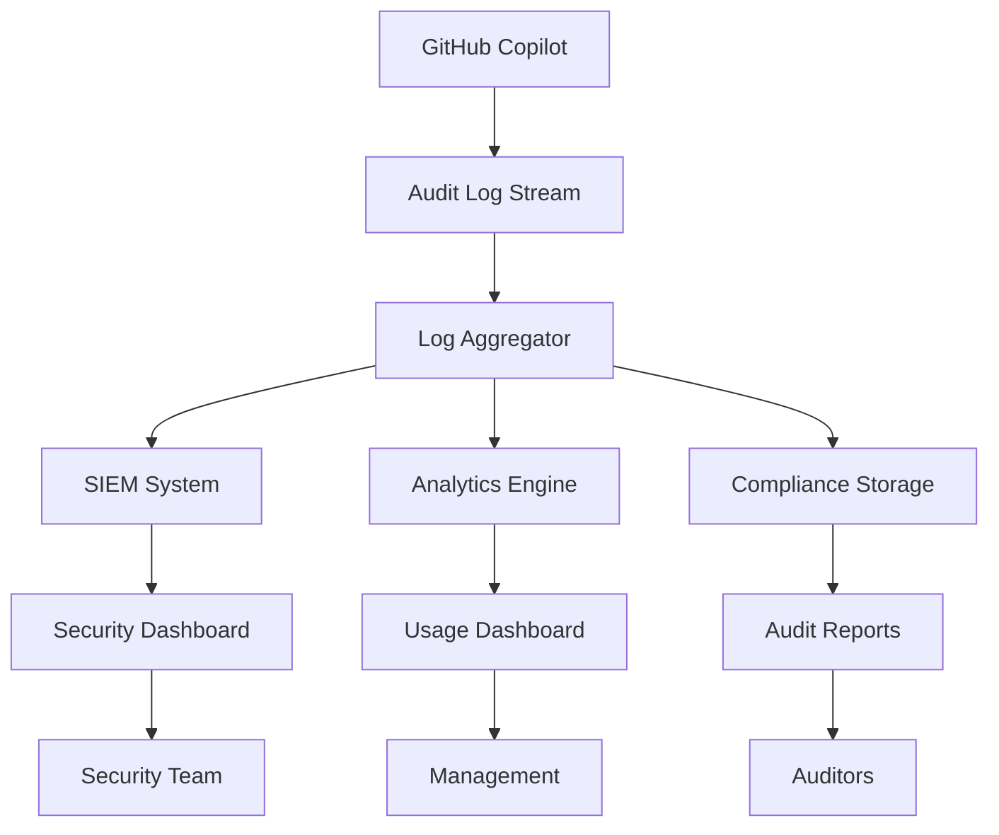

# GitHub Copilot Monitoring and Audit Logging for BFSI

This guide provides comprehensive monitoring, audit logging, and usage tracking solutions for GitHub Copilot Business in BFSI environments, ensuring compliance with RBI, SEBI, and IRDAI regulatory requirements.

## 🏛️ Overview

### Regulatory Requirements

| Regulator | Requirement | Implementation |
|-----------|-------------|----------------|
| **RBI** | 7-year audit trail retention | Automated log archival to compliant storage |
| **SEBI** | Real-time monitoring | Streaming analytics with alerting |
| **IRDAI** | Usage tracking and reporting | Comprehensive usage analytics dashboard |
| **ISO 27001** | Security event logging | Centralized SIEM integration |

## 📊 Monitoring Architecture



## 🔍 Audit Logging Configuration

### GitHub Organization Settings

```yaml
# audit-logging-config.yml
audit_configuration:
  organization: "bfsi-financial-org"
  
  # Copilot-specific audit events
  copilot_events:
    - "copilot.suggestion_generated"
    - "copilot.suggestion_accepted"
    - "copilot.suggestion_rejected"
    - "copilot.chat_interaction"
    - "copilot.code_generation"
    - "copilot.sensitive_content_filtered"
    - "copilot.policy_violation"
    
  # Access and permission events
  access_events:
    - "copilot.seat_assigned"
    - "copilot.seat_removed"
    - "copilot.policy_updated"
    - "copilot.team_access_changed"
    
  # Compliance events
  compliance_events:
    - "copilot.ip_protection_triggered"
    - "copilot.content_exclusion_applied"
    - "copilot.audit_log_accessed"
    - "copilot.export_restricted"
```

### Log Streaming Setup

#### Option 1: Splunk Integration

```bash
#!/bin/bash
# setup-splunk-streaming.sh

# Create Splunk HTTP Event Collector
curl -k -H "Authorization: Splunk ${SPLUNK_TOKEN}" \
     -H "Content-Type: application/json" \
     -X POST https://splunk.bfsi.internal:8088/services/collector/event \
     -d '{
       "event": {
         "source": "github_copilot",
         "sourcetype": "github_audit_log",
         "index": "bfsi_compliance"
       }
     }'

# Configure GitHub audit log streaming
gh api -X PUT /orgs/bfsi-financial-org/audit-log/streaming \
  -f delivery_url="https://splunk.bfsi.internal:8088/services/collector/event" \
  -f content_type="application/json" \
  -f secret="${SPLUNK_SECRET}"
```

#### Option 2: Azure Monitor Integration

```json
{
  "audit_stream_config": {
    "destination": "azure_monitor",
    "workspace_id": "12345678-1234-1234-1234-123456789012",
    "shared_key": "${AZURE_MONITOR_KEY}",
    "log_type": "GitHubCopilotAudit",
    "time_generated_field": "timestamp",
    
    "field_mapping": {
      "user_id": "actor.id",
      "user_name": "actor.login",
      "action": "action",
      "timestamp": "@timestamp",
      "repository": "repo",
      "copilot_suggestion": "data.suggestion",
      "accepted": "data.accepted",
      "ip_address": "actor_ip"
    }
  }
}
```

#### Option 3: Custom SIEM Integration

```python
# siem-integration.py
import json
import requests
from datetime import datetime

class BFSISIEMIntegration:
    def __init__(self, siem_endpoint, api_key):
        self.siem_endpoint = siem_endpoint
        self.api_key = api_key
        
    def process_copilot_event(self, event):
        """Process GitHub Copilot audit event for BFSI compliance"""
        
        # Extract key information
        processed_event = {
            'timestamp': event.get('@timestamp'),
            'event_type': 'github_copilot',
            'action': event.get('action'),
            'user_id': event.get('actor', {}).get('id'),
            'user_login': event.get('actor', {}).get('login'),
            'repository': event.get('repo'),
            'org': event.get('org'),
            
            # Copilot-specific fields
            'suggestion_generated': event.get('data', {}).get('suggestion_generated'),
            'suggestion_accepted': event.get('data', {}).get('suggestion_accepted'),
            'content_filtered': event.get('data', {}).get('content_filtered'),
            'ip_protection_triggered': event.get('data', {}).get('ip_protection'),
            
            # Compliance fields
            'regulatory_category': self.categorize_event(event),
            'risk_level': self.assess_risk(event),
            'requires_review': self.requires_human_review(event)
        }
        
        # Send to SIEM
        self.send_to_siem(processed_event)
        
        # Check for compliance violations
        if self.is_compliance_violation(processed_event):
            self.trigger_compliance_alert(processed_event)
    
    def categorize_event(self, event):
        """Categorize event for regulatory compliance"""
        action = event.get('action', '')
        
        if 'suggestion' in action:
            return 'code_assistance'
        elif 'policy' in action:
            return 'policy_enforcement'
        elif 'access' in action:
            return 'access_control'
        else:
            return 'general'
    
    def assess_risk(self, event):
        """Assess risk level of the event"""
        if event.get('ip_protection_triggered'):
            return 'high'
        elif event.get('content_filtered'):
            return 'medium'
        else:
            return 'low'
    
    def send_to_siem(self, event):
        """Send processed event to SIEM system"""
        headers = {
            'Authorization': f'Bearer {self.api_key}',
            'Content-Type': 'application/json'
        }
        
        response = requests.post(
            f'{self.siem_endpoint}/api/events',
            json=event,
            headers=headers
        )
        
        return response.status_code == 200
```

## 📈 Usage Analytics and Reporting

### Real-Time Dashboard Configuration

```yaml
# dashboard-config.yml
dashboards:
  executive_dashboard:
    title: "GitHub Copilot - Executive Summary"
    refresh_interval: "5m"
    
    widgets:
      - type: "metric"
        title: "Active Users"
        query: "copilot_users | stats dc(user_login)"
        
      - type: "trend"
        title: "Suggestions Accepted"
        query: "action=copilot.suggestion_accepted | timechart span=1h count"
        
      - type: "pie"
        title: "Usage by Department"
        query: "copilot_events | stats count by department"
        
      - type: "alert"
        title: "Compliance Issues"
        query: "regulatory_category=policy_violation | stats count"
        threshold: 0
        
  security_dashboard:
    title: "GitHub Copilot - Security Monitoring"
    refresh_interval: "1m"
    
    widgets:
      - type: "alert"
        title: "IP Protection Triggers"
        query: "ip_protection_triggered=true | stats count"
        
      - type: "table"
        title: "Filtered Content Events"
        query: "content_filtered=true | table timestamp, user_login, repository"
        
      - type: "heatmap"
        title: "Usage Patterns"
        query: "copilot_events | timechart span=1h count by user_login"
        
  compliance_dashboard:
    title: "GitHub Copilot - Compliance Monitoring"
    refresh_interval: "15m"
    
    widgets:
      - type: "metric"
        title: "Audit Events (24h)"
        query: "earliest=-24h | stats count"
        
      - type: "trend"
        title: "Policy Violations"
        query: "regulatory_category=policy_violation | timechart span=1d count"
        
      - type: "table"
        title: "High-Risk Events"
        query: "risk_level=high | table timestamp, user_login, action, repository"
```

### Automated Reporting

```python
# automated-reporting.py
import pandas as pd
from datetime import datetime, timedelta
import matplotlib.pyplot as plt
import seaborn as sns

class CopilotComplianceReporter:
    def __init__(self, data_source):
        self.data_source = data_source
    
    def generate_monthly_compliance_report(self, month, year):
        """Generate monthly compliance report for RBI/SEBI audit"""
        
        # Fetch data for the month
        start_date = datetime(year, month, 1)
        end_date = start_date + timedelta(days=32)
        end_date = end_date.replace(day=1) - timedelta(days=1)
        
        events = self.fetch_events(start_date, end_date)
        
        report = {
            'period': f"{month}/{year}",
            'total_events': len(events),
            'unique_users': events['user_login'].nunique(),
            'suggestions_generated': len(events[events['action'] == 'copilot.suggestion_generated']),
            'suggestions_accepted': len(events[events['action'] == 'copilot.suggestion_accepted']),
            'acceptance_rate': self.calculate_acceptance_rate(events),
            'ip_protection_triggers': len(events[events['ip_protection_triggered'] == True]),
            'content_filtering_events': len(events[events['content_filtered'] == True]),
            'policy_violations': len(events[events['regulatory_category'] == 'policy_violation']),
            'high_risk_events': len(events[events['risk_level'] == 'high']),
            
            # Compliance metrics
            'data_localization_compliance': self.check_data_localization(events),
            'audit_trail_completeness': self.verify_audit_completeness(events),
            'access_control_violations': self.check_access_violations(events),
            
            # Departmental breakdown
            'usage_by_department': events.groupby('department').size().to_dict(),
            'top_users': events['user_login'].value_counts().head(10).to_dict(),
            
            # Risk assessment
            'risk_summary': {
                'low': len(events[events['risk_level'] == 'low']),
                'medium': len(events[events['risk_level'] == 'medium']),
                'high': len(events[events['risk_level'] == 'high'])
            }
        }
        
        # Generate visualizations
        self.create_compliance_charts(events, report['period'])
        
        return report
    
    def generate_quarterly_security_assessment(self, quarter, year):
        """Generate quarterly security assessment for IRDAI compliance"""
        
        # Calculate quarter date range
        start_month = (quarter - 1) * 3 + 1
        start_date = datetime(year, start_month, 1)
        end_date = datetime(year, start_month + 2, 1) + timedelta(days=32)
        end_date = end_date.replace(day=1) - timedelta(days=1)
        
        events = self.fetch_events(start_date, end_date)
        
        security_metrics = {
            'period': f"Q{quarter} {year}",
            'security_events': len(events[events['event_type'] == 'security']),
            'failed_authentications': self.count_failed_auth(events),
            'unauthorized_access_attempts': self.count_unauthorized_access(events),
            'data_exfiltration_attempts': self.detect_data_exfiltration(events),
            'malicious_code_detection': self.detect_malicious_patterns(events),
            
            # Incident response metrics
            'incidents_detected': self.count_security_incidents(events),
            'incidents_resolved': self.count_resolved_incidents(events),
            'mean_time_to_detection': self.calculate_mttd(events),
            'mean_time_to_response': self.calculate_mttr(events),
            
            # Compliance status
            'compliance_score': self.calculate_compliance_score(events),
            'recommendations': self.generate_recommendations(events)
        }
        
        return security_metrics
```

## 🚨 Alerting and Incident Response

### Alert Configuration

```yaml
# alerts-config.yml
alerts:
  ip_protection_violation:
    condition: "ip_protection_triggered=true"
    severity: "high"
    notification:
      - email: ["security@bfsi-org.com", "compliance@bfsi-org.com"]
      - slack: "#security-alerts"
      - webhook: "https://incident-management.bfsi.internal/api/alerts"
    
  content_filtering_bypass:
    condition: "content_filtered=false AND sensitive_content=true"
    severity: "critical"
    notification:
      - email: ["ciso@bfsi-org.com"]
      - sms: ["+91XXXXXXXXXX"]
      - pagerduty: "copilot-security-team"
    
  unusual_usage_pattern:
    condition: "suggestions_per_hour > 100 BY user_login"
    severity: "medium"
    notification:
      - email: ["security@bfsi-org.com"]
      - slack: "#copilot-monitoring"
    
  policy_violation:
    condition: "regulatory_category=policy_violation"
    severity: "high"
    notification:
      - email: ["compliance@bfsi-org.com", "legal@bfsi-org.com"]
      - webhook: "https://compliance-system.bfsi.internal/api/violations"
    
  access_control_breach:
    condition: "unauthorized_access=true"
    severity: "critical"
    notification:
      - email: ["security@bfsi-org.com", "admin@bfsi-org.com"]
      - pagerduty: "incident-response-team"
      - webhook: "https://soc.bfsi.internal/api/incidents"
```

### Incident Response Playbook

```yaml
# incident-response-playbook.yml
incident_types:
  ip_protection_violation:
    severity: "high"
    response_time: "15 minutes"
    
    steps:
      1. "Immediately disable user access to Copilot"
      2. "Investigate the nature of the IP protection trigger"
      3. "Review user's recent Copilot activity"
      4. "Determine if proprietary code was involved"
      5. "Document findings for compliance team"
      6. "Restore access with additional monitoring if appropriate"
    
    escalation:
      - condition: "Proprietary financial algorithms involved"
        action: "Escalate to CISO and Legal team"
      - condition: "Customer data potentially exposed"
        action: "Trigger data breach response procedure"
    
  content_filtering_bypass:
    severity: "critical"
    response_time: "5 minutes"
    
    steps:
      1. "Immediately suspend user's Copilot access"
      2. "Analyze the bypassed content"
      3. "Check for data exfiltration"
      4. "Review and update content filtering rules"
      5. "Conduct security assessment"
      6. "Report to regulatory authorities if required"
    
  unusual_usage_pattern:
    severity: "medium"
    response_time: "1 hour"
    
    steps:
      1. "Review user's activity patterns"
      2. "Check for automated tool usage"
      3. "Verify legitimate business need"
      4. "Adjust rate limiting if necessary"
      5. "Provide user training if needed"
```

## 📊 Performance Metrics

### Key Performance Indicators (KPIs)

```yaml
# kpi-definitions.yml
copilot_kpis:
  productivity_metrics:
    - name: "Code Completion Rate"
      formula: "suggestions_accepted / suggestions_generated * 100"
      target: "> 30%"
      
    - name: "Developer Velocity"
      formula: "lines_of_code_with_copilot / average_lines_per_day"
      target: "> 120%"
      
    - name: "Time to Feature Completion"
      formula: "avg(feature_completion_time_with_copilot)"
      target: "< 80% of baseline"
  
  security_metrics:
    - name: "IP Protection Effectiveness"
      formula: "(ip_violations_prevented / total_potential_violations) * 100"
      target: "> 99%"
      
    - name: "Content Filtering Accuracy"
      formula: "(correctly_filtered / total_filtered) * 100"
      target: "> 95%"
      
    - name: "Security Incident Rate"
      formula: "security_incidents / total_copilot_usage_hours"
      target: "< 0.01%"
  
  compliance_metrics:
    - name: "Audit Trail Completeness"
      formula: "(logged_events / total_events) * 100"
      target: "100%"
      
    - name: "Policy Compliance Rate"
      formula: "(compliant_actions / total_actions) * 100"
      target: "> 99.5%"
      
    - name: "Regulatory Response Time"
      formula: "avg(time_to_regulatory_response)"
      target: "< 4 hours"
```

## 🔧 Implementation Scripts

### Monitoring Setup Script

```bash
#!/bin/bash
# setup-monitoring.sh

echo "🚀 Setting up GitHub Copilot monitoring for BFSI..."

# 1. Configure audit log streaming
echo "📝 Configuring audit log streaming..."
gh api -X PUT /orgs/${GITHUB_ORG}/audit-log/streaming \
  -f delivery_url="${AUDIT_LOG_ENDPOINT}" \
  -f content_type="application/json" \
  -f secret="${AUDIT_LOG_SECRET}"

# 2. Set up usage analytics
echo "📊 Enabling usage analytics..."
gh api -X PUT /orgs/${GITHUB_ORG}/copilot/usage \
  -f analytics_enabled=true \
  -f retention_days=2555  # 7 years for compliance

# 3. Configure alerting
echo "🚨 Setting up alerts..."
python3 setup-alerts.py --config alerts-config.yml

# 4. Deploy monitoring dashboards
echo "📈 Deploying monitoring dashboards..."
kubectl apply -f monitoring/dashboards/

# 5. Validate setup
echo "✅ Validating monitoring setup..."
python3 validate-monitoring.py

echo "🎉 Monitoring setup complete!"
```

### Health Check Script

```python
# health-check.py
import requests
import json
from datetime import datetime, timedelta

def check_monitoring_health():
    """Comprehensive health check for Copilot monitoring"""
    
    checks = {
        'audit_log_streaming': check_audit_streaming(),
        'usage_analytics': check_usage_analytics(),
        'alerting_system': check_alerting(),
        'dashboards': check_dashboards(),
        'compliance_reporting': check_compliance_reports()
    }
    
    overall_health = all(checks.values())
    
    return {
        'overall_health': 'healthy' if overall_health else 'degraded',
        'timestamp': datetime.now().isoformat(),
        'checks': checks,
        'recommendations': generate_recommendations(checks)
    }

def check_audit_streaming():
    """Check if audit log streaming is working"""
    try:
        # Check recent audit events
        recent_events = fetch_recent_audit_events()
        return len(recent_events) > 0
    except Exception as e:
        print(f"Audit streaming check failed: {e}")
        return False

def check_usage_analytics():
    """Check if usage analytics are being collected"""
    try:
        # Verify analytics data availability
        analytics_data = fetch_usage_analytics()
        return analytics_data is not None
    except Exception as e:
        print(f"Usage analytics check failed: {e}")
        return False

if __name__ == "__main__":
    health_status = check_monitoring_health()
    print(json.dumps(health_status, indent=2))
```

## 📞 Support and Troubleshooting

### Common Issues

#### Issue: Missing Audit Events
```bash
# Diagnosis
gh api /orgs/{org}/audit-log | jq '.[] | select(.action | contains("copilot"))'

# Solution: Verify streaming configuration
gh api /orgs/{org}/audit-log/streaming
```

#### Issue: Dashboard Not Updating
```bash
# Check data pipeline
curl -H "Authorization: Bearer ${API_TOKEN}" \
     "${ANALYTICS_ENDPOINT}/health"

# Restart analytics service
kubectl rollout restart deployment/copilot-analytics
```

#### Issue: Alerts Not Firing
```python
# Test alert conditions
from monitoring import test_alerts
test_alerts.run_all_tests()

# Check alert configuration
validate_alert_config('alerts-config.yml')
```

### Contact Information

- **Monitoring Team**: monitoring@bfsi-org.com
- **Security Operations**: soc@bfsi-org.com
- **Compliance Team**: compliance@bfsi-org.com
- **24/7 Support**: +91-XXXX-XXXXXX

---

**Next Steps**: Proceed to [Prompt Engineering Examples](../prompts/README.md) to learn how to effectively work with legacy systems.