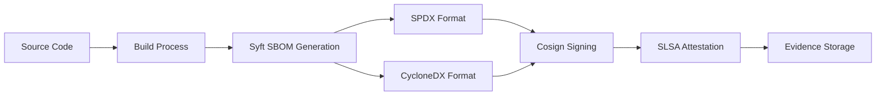

# Spec 002: SBOM and Signature Chain Automation

**Status**: Draft  
**Version**: 1.0  
**Created**: 2024  
**Last Updated**: 2024  
**Owner**: BFSI Security Team  

## Overview

This specification defines the implementation of automated Software Bill of Materials (SBOM) generation and artifact signature chain workflows for Banking, Financial Services, and Insurance (BFSI) organizations in India, ensuring compliance with regulatory requirements from RBI, SEBI, and IRDAI.

## Objectives

1. **Automated SBOM Generation**: Generate comprehensive SBOMs for all built artifacts in multiple industry-standard formats
2. **Artifact Signing**: Implement cryptographic signing of all build artifacts and SBOMs using industry-standard tools
3. **SLSA Compliance**: Provide SLSA Level 2+ compatible attestation and provenance verification
4. **Regulatory Compliance**: Ensure evidence retention and audit trails meet 7-year BFSI regulatory requirements
5. **CI/CD Integration**: Seamlessly integrate with existing BFSI runner infrastructure and workflows

## Regulatory Context

### RBI IT Framework Compliance
- **Audit Trail Requirements**: Complete activity logging with 7-year retention
- **Data Integrity**: Cryptographic verification of all artifacts
- **Access Controls**: Integration with BFSI runner label security model
- **Change Management**: Comprehensive tracking of software components

### SEBI IT Governance
- **System Governance**: Documented software component inventory
- **Risk Management**: Vulnerability tracking through SBOM analysis
- **Compliance Validation**: Automated compliance checking in CI/CD

### IRDAI Cybersecurity Guidelines
- **Supply Chain Security**: Third-party component risk assessment
- **Security Controls**: Cryptographic signing and verification
- **Business Continuity**: Tamper-evident artifact management

## Technical Architecture

### SBOM Generation Pipeline



### Component Overview

1. **SBOM Generators**
   - Primary: Anchore Syft (supports multiple ecosystems)
   - Secondary: CycloneDX CLI (npm ecosystem)
   - Output formats: SPDX-JSON, CycloneDX-JSON, Table format

2. **Signing Infrastructure**
   - Tool: Sigstore Cosign
   - Method: Keyless signing with OIDC
   - Transparency: Certificate Transparency logs
   - Storage: GitHub artifact storage with extended retention

3. **Attestation Framework**
   - Standard: SLSA (Supply-chain Levels for Software Artifacts)
   - Level: 2+ compliance
   - Format: in-toto attestation format
   - Verification: Cryptographic proof of build integrity

## Implementation Requirements

### Mandatory Features

1. **Multi-format SBOM Generation**
   - SPDX 2.3+ JSON format (primary)
   - CycloneDX 1.4+ JSON format (secondary)
   - Human-readable table format (audit purposes)

2. **Cryptographic Signing**
   - All SBOMs must be signed using Cosign
   - All build artifacts must be signed
   - Keyless signing using GitHub OIDC tokens
   - Certificate transparency logging required

3. **SLSA Attestation**
   - Generate SLSA v0.2+ attestations
   - Include provenance metadata
   - Sign attestations cryptographically
   - Store with 7-year retention

4. **Compliance Evidence**
   - Comprehensive audit trail generation
   - Regulatory framework mapping
   - Evidence integrity verification
   - Long-term retention compliance

### Runner Environment Integration

The SBOM action must integrate with the existing BFSI runner label system:

- `bfsi-secure`: Security-focused SBOM operations
- `bfsi-build`: Build-time SBOM generation
- `bfsi-compliance`: Compliance evidence generation
- `bfsi-audit`: Audit trail and reporting

### Configuration Parameters

| Parameter | Type | Default | Description |
|-----------|------|---------|-------------|
| `scan-path` | string | `.` | Path to scan for SBOM generation |
| `sbom-format` | string | `spdx-json` | Primary SBOM format |
| `enable-signing` | boolean | `true` | Enable artifact signing |
| `enable-attestation` | boolean | `true` | Enable SLSA attestation |
| `compliance-evidence-retention` | number | `2555` | Retention days (7 years) |
| `runner-environment` | string | `dev` | Target environment |

## Security Considerations

### Threat Model

1. **Supply Chain Attacks**
   - Mitigation: Comprehensive SBOM generation and signing
   - Detection: Automated vulnerability scanning of components

2. **Artifact Tampering**
   - Mitigation: Cryptographic signatures with transparency logging
   - Verification: Automated signature verification in deployment

3. **Compliance Violations**
   - Mitigation: Automated compliance checking and evidence generation
   - Audit: 7-year evidence retention with integrity protection

### Security Controls

1. **Authentication & Authorization**
   - GitHub OIDC for keyless signing
   - BFSI runner labels for environment isolation
   - Role-based access to compliance evidence

2. **Data Integrity**
   - SHA-256 hashing of all artifacts
   - Cryptographic signatures using ECDSA
   - Certificate transparency for public verification

3. **Non-Repudiation**
   - Immutable audit trails in GitHub Actions
   - Signed attestations with timestamps
   - Long-term evidence retention

## Integration Patterns

### Workflow Integration

```yaml
jobs:
  build:
    runs-on: [self-hosted, bfsi-build]
    steps:
      - uses: actions/checkout@v4
      - name: Build Application
        run: mvn clean package
      - name: Generate SBOM and Sign
        uses: ./actions/sbom
        with:
          artifact-path: 'target/*.jar'
          runner-environment: 'production'
```

### Evidence Workflow

```yaml
jobs:
  compliance-evidence:
    runs-on: [self-hosted, bfsi-compliance]
    needs: [build]
    steps:
      - name: Collect Evidence
        uses: ./actions/sbom
        with:
          compliance-evidence-retention: '2555'
```

## Compliance Mapping

### RBI IT Framework Requirements

| Requirement | Implementation | Evidence |
|-------------|---------------|----------|
| IT-R1: Audit Trail | Complete SBOM generation logs | GitHub Actions logs + SBOM files |
| IT-R2: Data Integrity | Cryptographic signing | Cosign signatures + certificates |
| IT-R3: Change Management | Component version tracking | SBOM component inventory |
| IT-R4: Documentation | Comprehensive SBOM documentation | SPDX + CycloneDX formats |

### SEBI IT Governance

| Control | Implementation | Verification |
|---------|---------------|--------------|
| SG-1: System Documentation | SBOM as software inventory | Automated SBOM generation |
| SG-2: Risk Assessment | Component vulnerability data | SBOM + security scanning |
| SG-3: Change Control | Version tracking in SBOM | Git commit + SBOM correlation |

### IRDAI Cybersecurity

| Guideline | Implementation | Compliance |
|-----------|---------------|------------|
| CS-1: Supply Chain Security | Third-party component tracking | SBOM component analysis |
| CS-2: Data Protection | Cryptographic integrity | Signed artifacts + attestations |
| CS-3: Incident Response | Component vulnerability alerts | SBOM security analysis |

## Validation & Testing

### Unit Tests
- SBOM generation functionality
- Signing and verification processes
- Attestation format compliance
- Error handling scenarios

### Integration Tests
- End-to-end workflow validation
- Multiple artifact type support
- Compliance evidence generation
- Long-term retention verification

### Compliance Tests
- Regulatory requirement coverage
- Audit trail completeness
- Evidence integrity verification
- Retention policy compliance

## Rollout Strategy

### Phase 1: Core Implementation (Week 1-2)
- Basic SBOM generation action
- Cosign integration for signing
- SLSA attestation generation
- Initial documentation

### Phase 2: Compliance Integration (Week 3-4)
- BFSI runner integration
- Compliance evidence generation
- Extended retention implementation
- Regulatory framework mapping

### Phase 3: Production Deployment (Week 5-6)
- Java Spring Boot CI integration
- Production workflow updates
- Monitoring and alerting
- Training and documentation

### Phase 4: Ecosystem Expansion (Week 7-8)
- Additional language support
- Advanced compliance features
- Performance optimization
- Comprehensive testing

## Monitoring & Metrics

### Key Performance Indicators

1. **SBOM Generation Success Rate**: Target 99.9%
2. **Signing Success Rate**: Target 100%
3. **Compliance Evidence Completeness**: Target 100%
4. **Evidence Retention Compliance**: Target 100%

### Monitoring Dashboard

- SBOM generation metrics
- Signing operation status
- Compliance evidence health
- Regulatory requirement coverage

## Maintenance & Support

### Regular Updates
- Monthly tool version updates
- Quarterly compliance requirement reviews
- Annual regulatory framework updates
- Continuous security improvements

### Support Channels
- GitHub Issues for bug reports
- Internal documentation wiki
- Security team consultation
- Compliance team reviews

## Conclusion

This specification provides a comprehensive framework for implementing SBOM and signature chain automation that meets the stringent requirements of Indian financial institutions while maintaining operational efficiency and security best practices.

The implementation ensures full compliance with RBI, SEBI, and IRDAI requirements while providing a foundation for advanced supply chain security and regulatory compliance automation.